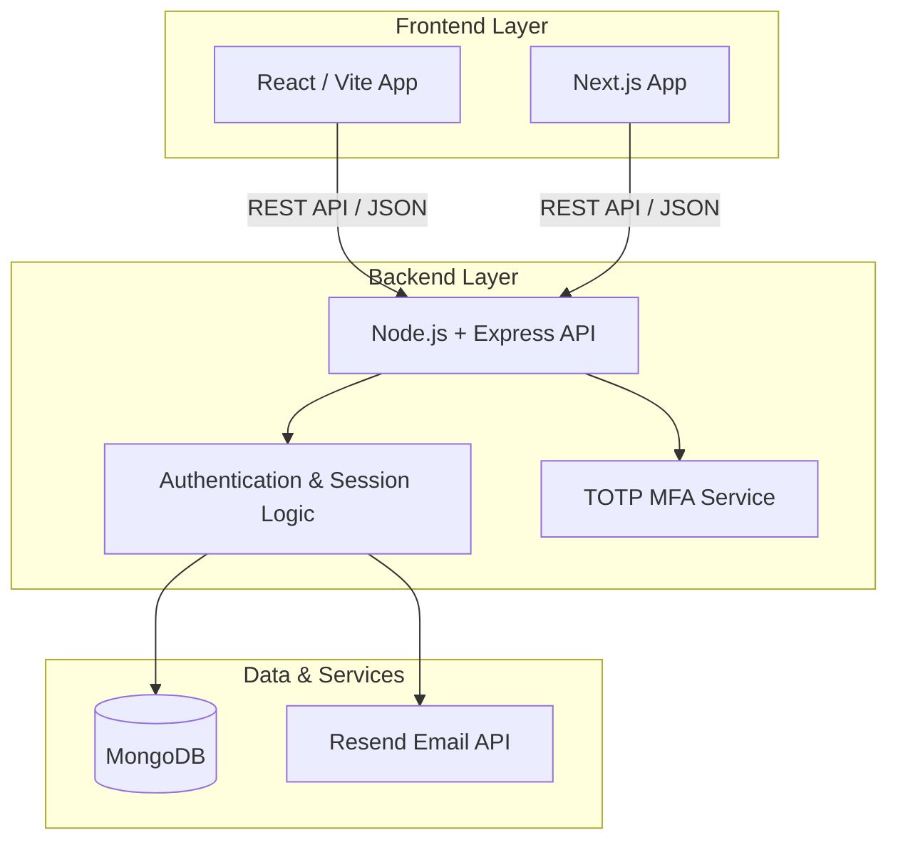
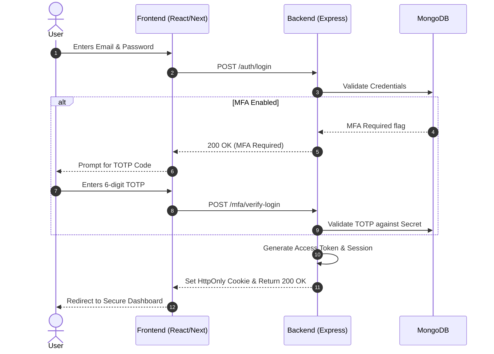

# 🛡️ Hack-It AI Authentication

<div align="center">
  
  
  
  
  
  
  
</div>

<br />

Hack-It AI Authentication is a highly secure, full-stack authentication and session management system. It provides both a **React (Vite)** and **Next.js** frontend out-of-the-box, connected to a robust **Node.js/Express** backend powered by **MongoDB**. 

---

## ✨ Key Features

| Feature | Description | Status |
| :--- | :--- | :---: |
| 🔐 **Authentication** | Secure Email/Password registration and login. | ✅ |
| 📱 **Multi-Factor Auth** | Time-based One-Time Password (TOTP) support using authenticator apps. | ✅ |
| 🔄 **Session Management** | Track, manage, and revoke active sessions across multiple devices. | ✅ |
| 📧 **Email Verification** | Mandatory email verification for new accounts via Resend. | ✅ |
| 🔑 **Password Recovery** | Secure forgot/reset password flow using expiring tokens. | ✅ |
| 🎨 **Theming** | Fully responsive Light & Dark modes built with Tailwind CSS. | ✅ |

---

## 🏗️ System Architecture

The application is built using a decoupled architecture, allowing you to seamlessly switch between the React and Next.js clients.



---

## 🌊 Authentication Flow

Below is the standard flow for a user logging in with Multi-Factor Authentication enabled.



---

## ⚙️ Environment Variables

To run this project, you will need to add the following environment variables to your respective `.env` files.

### Backend (`/backend/.env`)
| Variable | Description |
| :--- | :--- |
| `PORT` | The port your backend server runs on (e.g., 8000) |
| `NODE_ENV` | `development` or `production` |
| `MONGO_URI` | Your MongoDB connection string |
| `JWT_SECRET` | Secret key for signing Access Tokens |
| `JWT_EXPIRES_IN` | Expiration time for tokens (e.g., `15m`) |
| `RESEND_API_KEY` | API key from Resend for sending emails |
| `APP_ORIGIN` | URL of your frontend application |

### Frontends (`/react-frontend/.env` & `/next-frontend/.env`)
| Variable | Description |
| :--- | :--- |
| `VITE_API_URL` | Base URL of the backend API (React) |
| `NEXT_PUBLIC_API_URL` | Base URL of the backend API (Next.js) |

---

## 🚀 Getting Started

### 1. Clone the repository
```bash
git clone https://github.com/Mausam5055/MERN-Auth-System.git
cd MERN-Auth-System
```

### 2. Install dependencies
Install dependencies for the backend and your frontend of choice:
```bash
# Backend
cd backend && npm install

# React Frontend
cd react-frontend && npm install

# Next.js Frontend
cd next-frontend && npm install
```

### 3. Start the development servers
Open multiple terminal windows to run the backend and frontend simultaneously.

```bash
# Terminal 1: Backend
cd backend
npm run dev

# Terminal 2: React Frontend
cd react-frontend
npm run dev
```

---

## 👨‍💻 Developer

Designed and developed by **Mausam Kumar** 🚀.
