<div align="center">

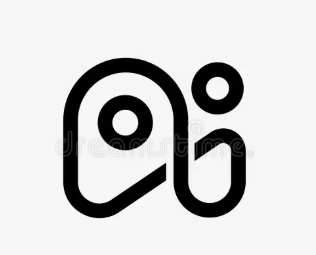

# 🚀 HACK-IT AI

### *The Ultimate AI-Powered Hackathon Intelligence Platform*

> **From idea to pitch-ready presentation in minutes — powered by a Multi-Agent Orchestration Engine**

---

[](https://nextjs.org)
[](https://fastapi.tiangolo.com)
[](https://python.org)
[](https://www.typescriptlang.org)
[](https://react.dev)
[](https://openai.com)
[](https://anthropic.com)
[](https://gemini.google.com)
[](https://groq.com)
[](https://ollama.com)
[](https://docker.com)
[](https://kubernetes.io)
[](https://sqlite.org)
[](https://postgresql.org)
[](https://tailwindcss.com)
[](https://redux-toolkit.js.org)
[](https://framer.com/motion)
[](https://microsoft.github.io/monaco-editor)
[](#-authentication--2fa)
[](#two-factor-authentication-2fa)
[](#email-otp-verification-via-resend)
[](https://mem0.ai)
[](#-mcp-server)
[](https://fastembed.net)
[](#workflow-3----ai-interview-preparation)
[](https://www.npmjs.com/package/hackit-ai)
[](https://pytest.org)
[](https://sentry.io)
[](https://mixpanel.com)
[](https://alembic.sqlalchemy.org)
[](LICENSE)

</div>

---

## 📽️ Platform Demos

> Key platform feature demos showcasing core functionality.

<table>
  <tr>
    <td align="center" width="50%">
      <b>💻 CLI DEMO</b><br/><br/>
      
      <br/><sub>Autonomous TUI agent CLI orchestration &amp; multi-agent execution</sub>
    </td>
    <td align="center" width="50%">
      <b>🎬 Presentation Maker</b><br/><br/>
      
      <br/><sub>AI slide deck creation from prompt or document upload</sub>
    </td>
  </tr>
  <tr>
    <td align="center" width="50%">
      <b>🤖 AI Coach</b><br/><br/>
      
      <br/><sub>Strategic advisor powered by OpenRouter OSS 120B</sub>
    </td>
    <td align="center" width="50%">
      <b>🎙️ AI Interview</b><br/><br/>
      
      <br/><sub>Voice-enabled mock interviews with real-time AI feedback</sub>
    </td>
  </tr>
  <tr>
    <td align="center" width="50%">
      <b>⚡ AI Workflow Builder</b><br/><br/>
      
      <br/><sub>Visual drag-and-drop multi-agent workflow designer</sub>
    </td>
    <td align="center" width="50%">
      <b>🏆 Hackathons &amp; Resources</b><br/><br/>
      
      <br/><sub>Live hackathon browser with filters &amp; resource library</sub>
    </td>
  </tr>
</table>

---

## 📋 Table of Contents

| Section | Description |
|---------|-------------|
| [🧠 Multi-Agent Orchestration](#-multi-agent-orchestration-engine) | Core AI agent pipeline and autonomous builder |
| [✨ 6 AI Workflows](#-6-ai-workflows) | Every AI-powered pipeline in detail |
| [🏛️ System Architecture](#-system-architecture) | High-level overview, request lifecycle, component tree |
| [🔐 Authentication and 2FA](#-authentication--2fa) | Custom PBKDF2 + TOTP 2FA + email OTP |
| [⚡ Tech Stack](#-tech-stack) | Full frontend, backend, infra technology tables |
| [📁 Project Structure](#-project-structure) | Complete directory map |
| [🗄️ Database Schema](#-database-schema) | ER diagram + 13 tables documented |
| [🤖 LLM Providers](#-llm-providers) | 15 LLM + 6 image + 5 search providers |
| [🔌 MCP Server](#-mcp-server) | FastMCP AI tool bridge |
| [📡 API Reference](#-api-reference) | All REST endpoints |
| [🚀 Deployment](#-deployment) | Docker, Kubernetes, Vercel, Electron |
| [🛠️ Development Setup](#-development-setup) | Local dev quickstart |
---

## 🧠 Multi-Agent Orchestration Engine

> **HACKIT** ships with a complete autonomous multi-agent system (`app_builder/`) — a React/Ink TUI that orchestrates **6 specialized AI agents** to take a hackathon idea from concept to a fully-built, scored, and pitch-ready full-stack project.

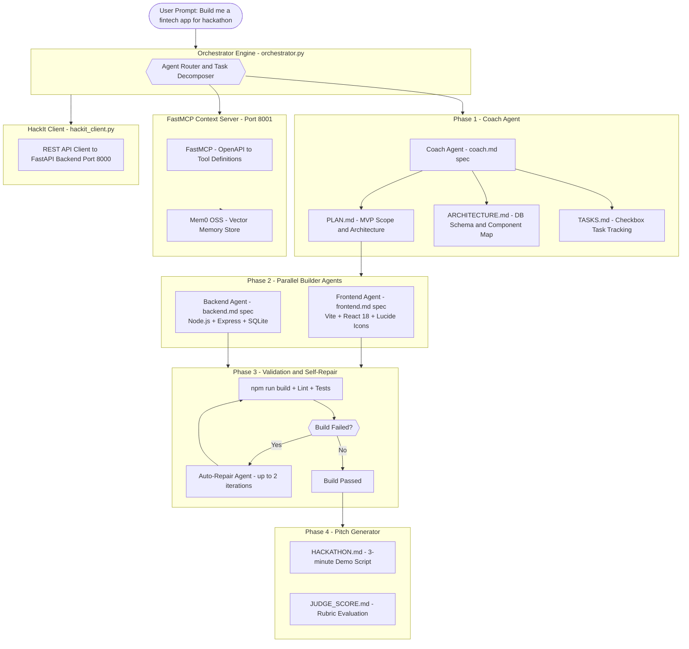

### Agent Specifications

| Agent | Spec File | Role | Output |
|-------|-----------|------|--------|
| **Coach Agent** | `agents/coach.md` | Planning, scope definition, architecture design | PLAN.md, ARCHITECTURE.md, TASKS.md |
| **Frontend Builder** | `agents/frontend.md` | Generates complete React frontend | Vite + React 18 + Lucide + dark-mode UI |
| **Backend Builder** | `agents/backend.md` | Generates complete Node.js backend | Express + SQLite + REST API |
| **Validation Agent** | `orchestrator.py` | Build verification + log analysis | Error reports, repair instructions |
| **Auto-Repair Agent** | `orchestrator.py` | Self-healing code fix loop | Patched source files (up to 2 passes) |
| **Pitch Agent** | `orchestrator.py` | Hackathon demo and judge scoring | HACKATHON.md + JUDGE_SCORE.md |

### Generated Project Artifacts

| File | Purpose |
|------|---------|
| `frontend/` | React 18 + Vite 5 complete frontend app |
| `backend/` | Node.js + Express REST API server |
| `PLAN.md` | Executive summary, MVP scope, stretch goals |
| `ARCHITECTURE.md` | Technical design, component map, DB schema |
| `TASKS.md` | Checkbox task tracking list |
| `WALKTHROUGH.md` | Codebase map and verification steps |
| `NEXT-STEPS.md` | Prompts for incremental feature expansion |
| `HACKATHON.md` | 3-minute pitch outline and live demo script |
| `JUDGE_SCORE.md` | AI judge scoring against hackathon rubrics |

### Quick Launch

```bash
# Run instantly with no install
npx hackit-ai

# Install globally
npm install -g hackit-ai
hackit "create an AI-powered expense tracker"

# Launch from source
cd app_builder
pip install -r requirements-runtime.txt
python tui.py
```

### TUI Keyboard Controls

| Key | Action |
|-----|--------|
| `Tab` | Cycle Tech Stack: Vite+React, Next.js, Vanilla, Vue 3, Custom |
| `Up` / `Down` | Scroll live pipeline build logs |
| `/new` | Reset workspace and start fresh project |
| `Ctrl+C` | Safely exit and restore terminal |

### 🖥️ CLI in Action

https://github.com/Rachit-Tiwari-7/HACKIT-AI/raw/main/frontend/public/hac-kit%20cli%20demo.mp4

---

## ✨ 6 AI Workflows

> Every workflow uses SSE streaming, parallel LLM calls, and long-term Mem0 memory injection.

---

### Workflow 1 — AI Presentation Generation

The flagship multi-step pipeline converting a prompt or document into a professional slide deck.

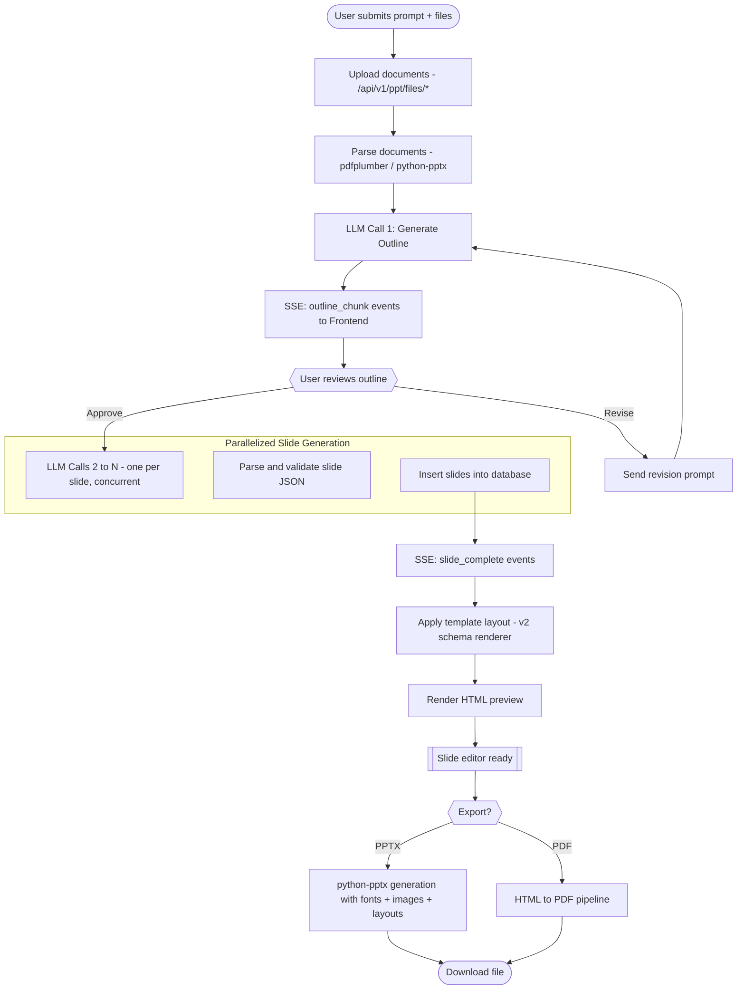

---

### Workflow 2 — AI Hackathon Coach

Context-aware strategic advisor powered by OpenRouter OSS 120B.

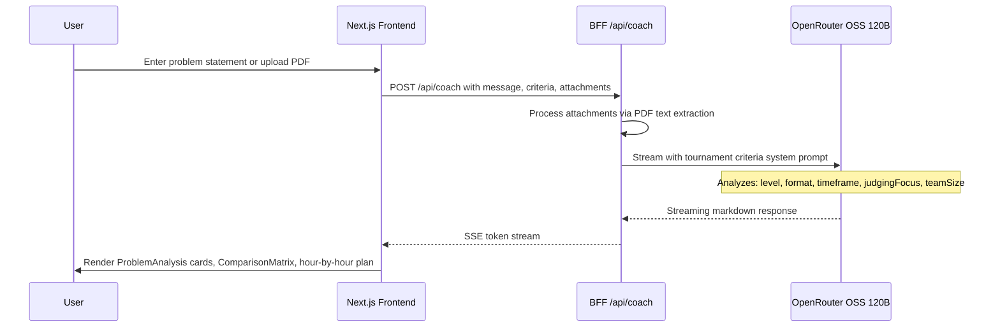

**Outputs:** Problem ranking with win-probability scores, tech stack matrix, hour-by-hour execution plan, judge rubric alignment.

---

### Workflow 3 — AI Interview Preparation

Voice-enabled mock interview system via Vapi AI Web SDK.

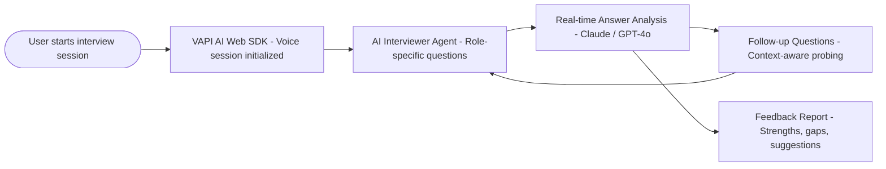

---

### Workflow 4 — AI Workflow Builder (Visual Automation Designer)

Drag-and-drop canvas for designing multi-agent AI pipelines, powered by Groq fast inference.

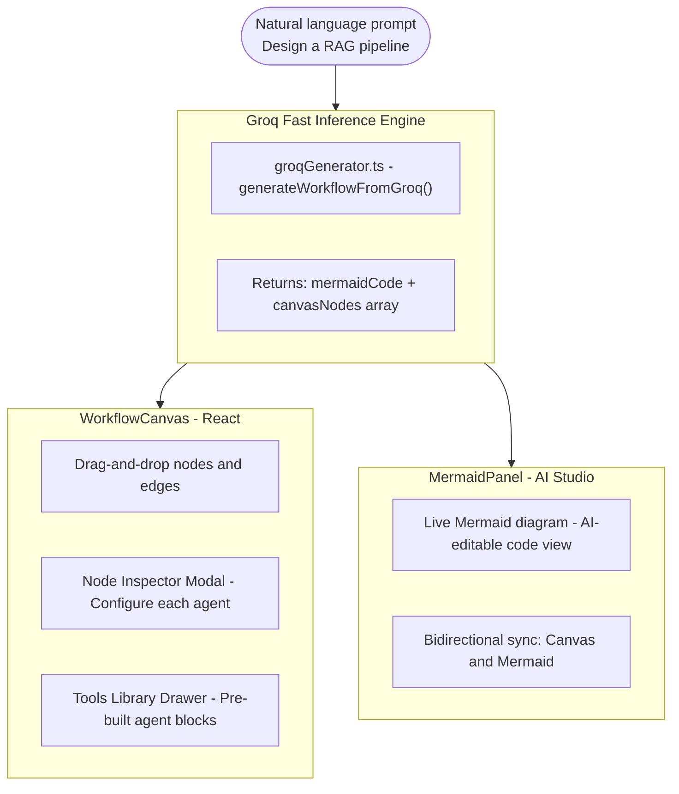

---

### Workflow 5 — Chat with Presentation (Context-Aware RAG)

Full slide context + Mem0 long-term memory injected into every LLM message.

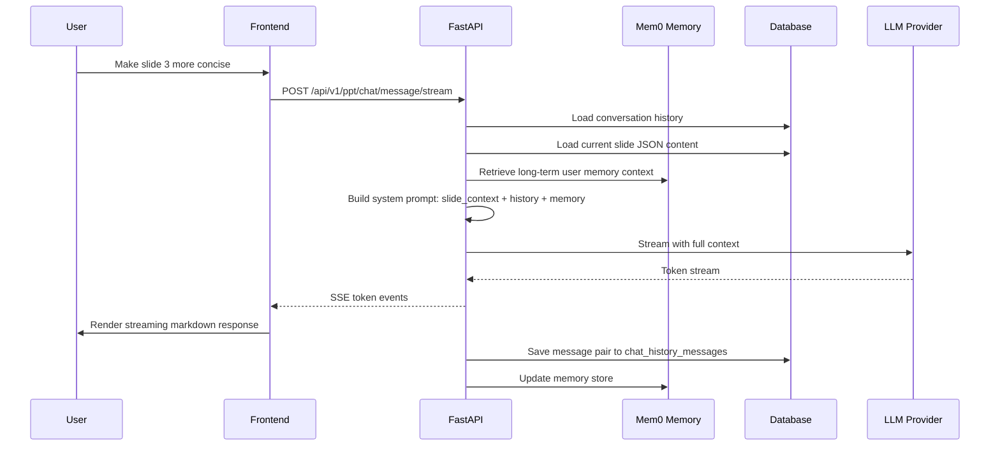

---

### Workflow 6 — Async Export and Webhook Pipeline

Long-running PPTX/PDF export jobs run asynchronously with signed webhook delivery on completion.

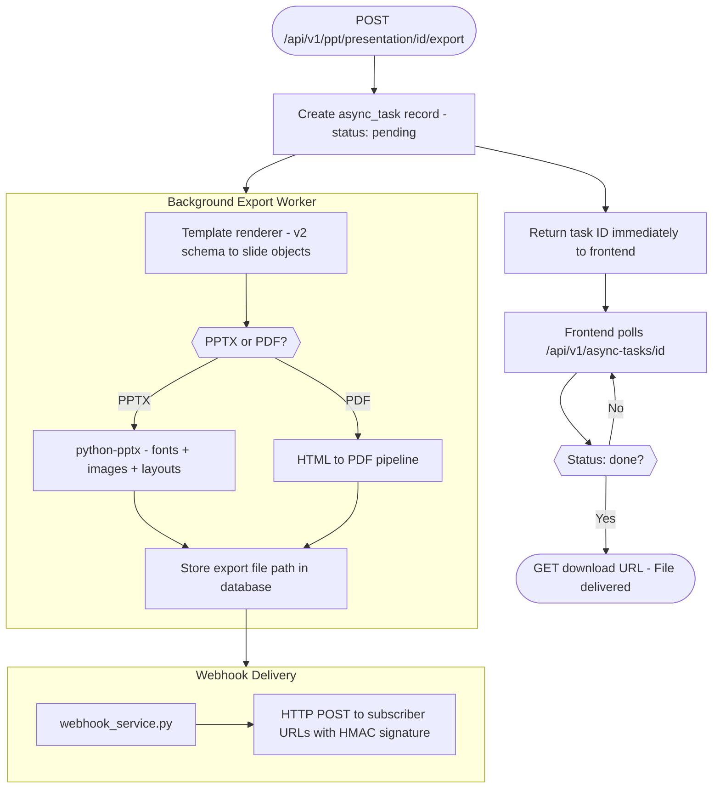

---

## 🏛️ System Architecture

### High-Level Platform Overview

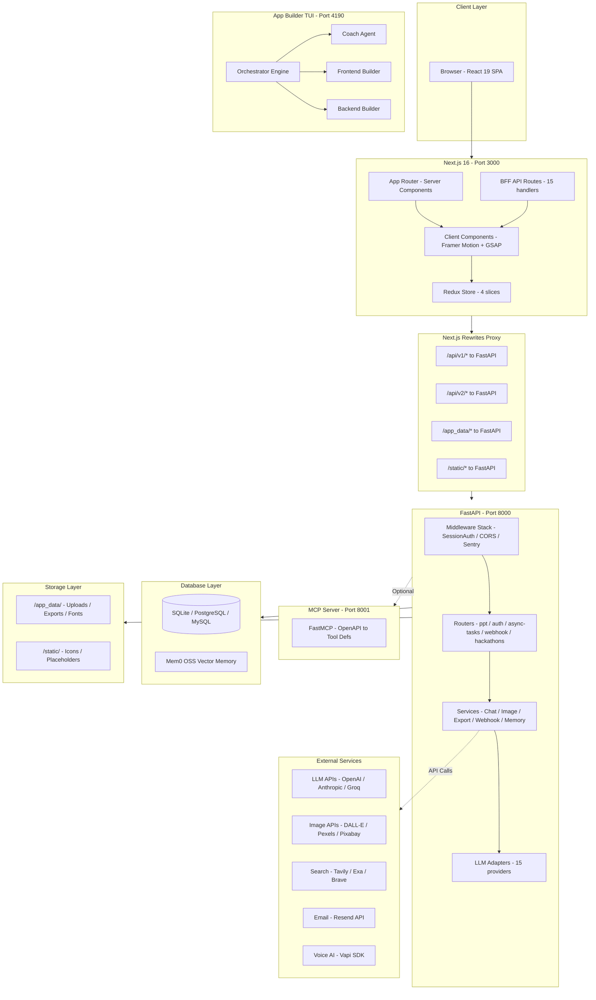

### Request Lifecycle

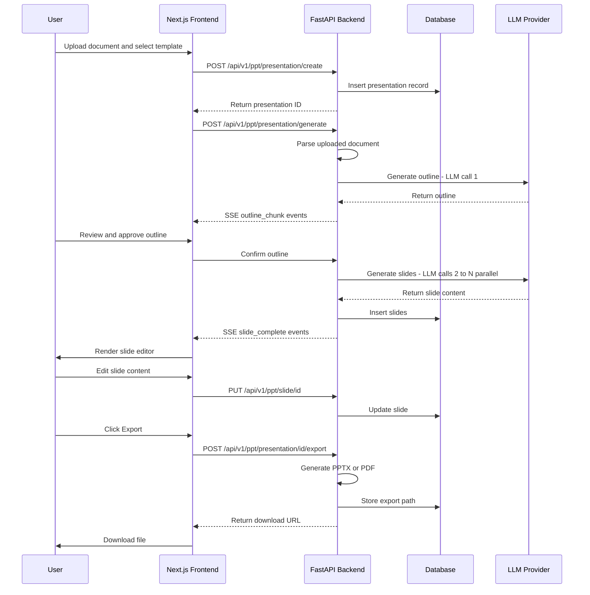

### Frontend Component Tree

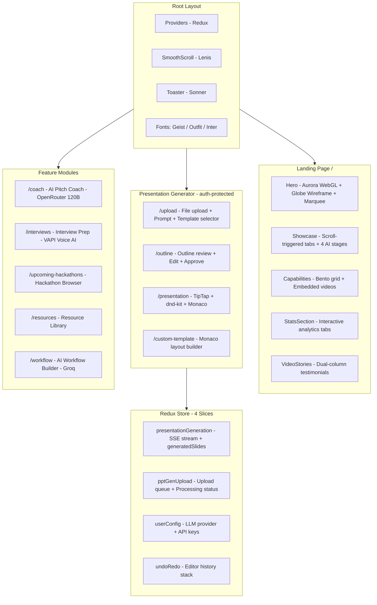

---

## 🔐 Authentication & 2FA

> HACKIT ships with a **fully custom, enterprise-grade auth system** built entirely from scratch in `backend/utils/simple_auth.py`. Zero third-party auth library dependency.

### Authentication Architecture

### 1. Registration Flow

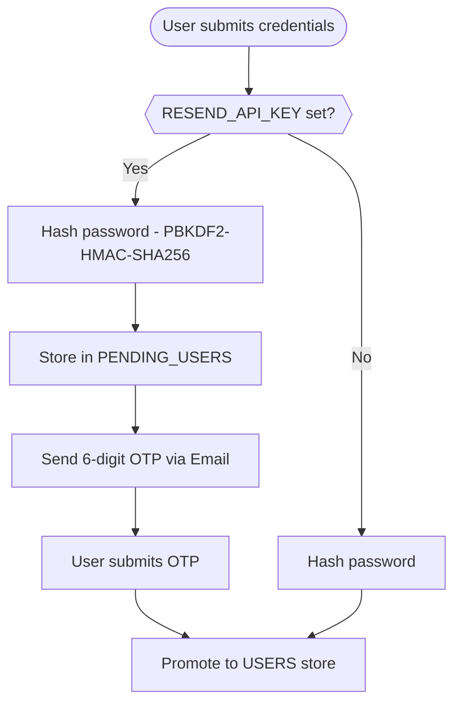

### 2. Login Flow

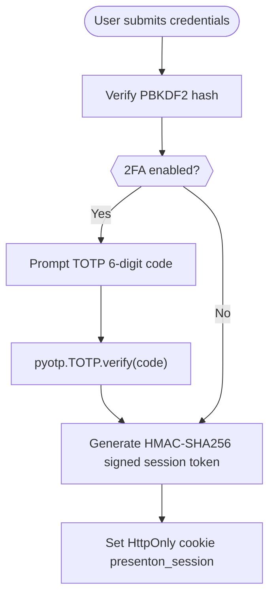

### 3. Session Validation (Every API Request)

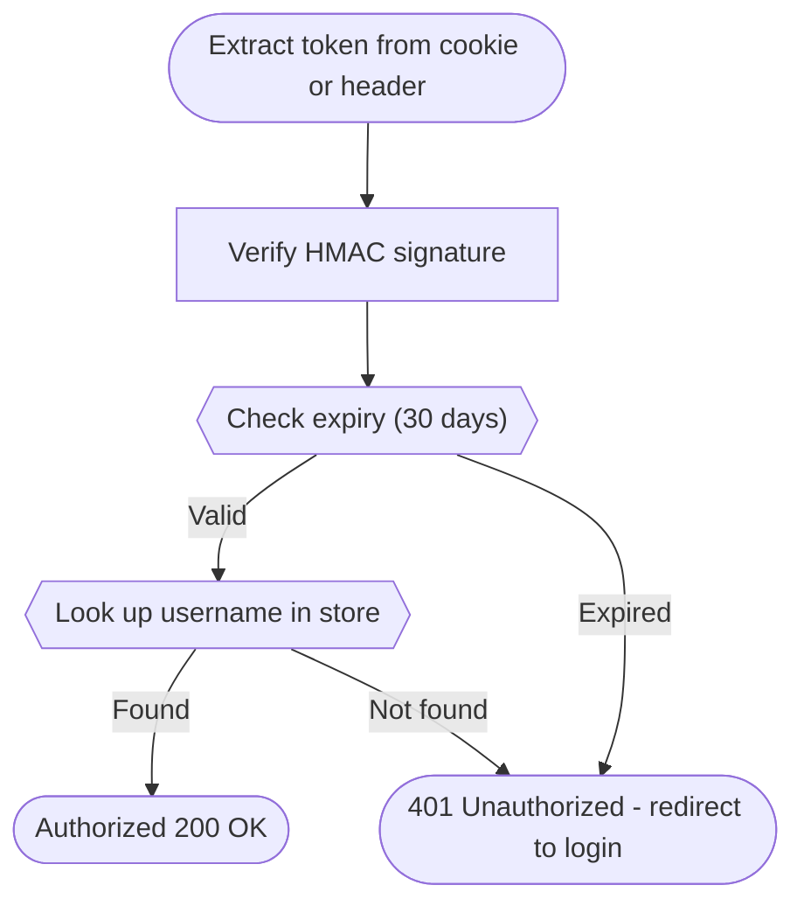

### Password Security

| Property | Value |
|----------|-------|
| **Algorithm** | PBKDF2-HMAC-SHA256 |
| **Iterations** | 200,000 (NIST recommended minimum) |
| **Salt** | 16-byte cryptographic random via `secrets.token_bytes` |
| **Comparison** | Constant-time `hmac.compare_digest()` — prevents timing attacks |
| **Storage** | `user-config.json` in `APP_DATA_DIRECTORY` |
| **Format** | `pbkdf2_sha256$200000$<salt_b64url>$<digest_b64url>` |

### Session Tokens

| Property | Value |
|----------|-------|
| **Signing Algorithm** | HMAC-SHA256 |
| **Payload** | `{"v":1, "u":username, "iat":issued_at, "exp":expiry}` |
| **Encoding** | Base64URL (URL-safe, no padding) |
| **TTL** | 30 days |
| **Transport** | HTTP-only cookie `presenton_session` OR `Authorization: Bearer <token>` |
| **Service-to-Service** | `Authorization: Basic <base64>` fallback |

### Two-Factor Authentication (2FA)

Full TOTP implementation using `pyotp` and QR code SVG generation via `qrcode`:

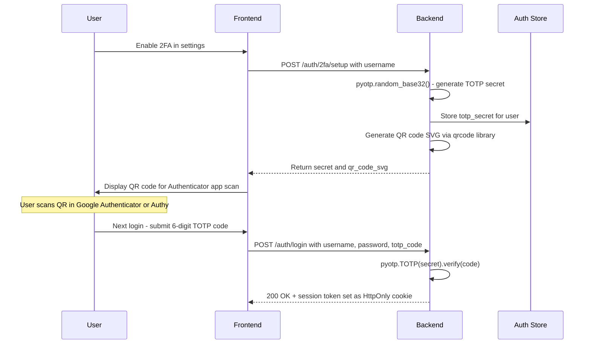

### Email OTP Verification (via Resend)

| Step | Action |
|------|--------|
| 1 | User registers with email as username |
| 2 | 6-digit OTP generated via `random.randint(0, 999999)` |
| 3 | Credentials stored in `PENDING_USERS` (temporary) |
| 4 | Email dispatched via Resend API from `onboarding@resend.dev` |
| 5 | User submits OTP → `verify_email_code()` validates match |
| 6 | Credentials promoted from `PENDING_USERS` → `USERS` |

### Auth Modes

| Mode | Environment Variable | Behavior |
|------|---------------------|----------|
| **Disabled** | `DISABLE_AUTH=true` | No auth required (Electron desktop default) |
| **Enabled** | `DISABLE_AUTH=false` | Login/setup flow enforced on all /api/* |
| **Auto-Setup** | `AUTH_USERNAME` + `AUTH_PASSWORD` | Credentials bootstrapped from env at startup |
| **Override** | `AUTH_OVERRIDE_FROM_ENV=true` | Overwrites any stored credentials |
| **Reset** | `RESET_AUTH=true` | Clears all stored credentials |
| **Email OTP** | `RESEND_API_KEY=<key>` | Email verification enabled on signup |
| **TOTP 2FA** | Enabled via UI settings | QR code + pyotp TOTP verification per login |

### Protected Paths

| Status | Paths |
|--------|-------|
| **Protected** | All `/api/*`, `/docs`, `/openapi.json`, `/redoc` |
| **Public** | `/api/v1/auth/*`, `/app_data/images/*`, `/app_data/fonts/*` |

---

## ⚡ Tech Stack

### Frontend

| Category | Technology | Version | Purpose |
|----------|-----------|---------|---------|
| **Framework** |  Next.js App Router | 16.2.10 | SSR + client-side routing |
| **Language** |  TypeScript | 5.x | Type-safe development |
| **UI Library** |  React | 19.2.4 | Component-based UI |
| **Styling** |  Tailwind CSS | 4.x | Utility-first CSS |
| **Component System** |  shadcn/ui (Radix) | base-nova | Accessible UI components |
| **State Management** |  Redux Toolkit | 2.2.8 | Global state (4 slices) |
| **Server State** |  TanStack Query + SWR | 5.x / 2.x | Data fetching & caching |
| **Text Editor** |  TipTap (ProseMirror) | 2.x | Rich-text slide editing |
| **Code Editor** |  Monaco Editor | 4.x | Layout code + custom templates |
| **Drag & Drop** |  dnd-kit | 6.x / 10.x | Slide reordering |
| **Animation** |  Framer Motion + GSAP + Lenis | 12.x / 3.15 / 1.3 | Micro-animations + smooth scroll |
| **3D / WebGL** |  ogl + react-konva + d3 | 1.x / 19.x / 7.x | Aurora hero + globe wireframe |
| **Charts** |  Chart.js + Recharts + Mermaid | 4.x / 3.x / 11.x | Analytics + diagrams |
| **Form Validation** |  Zod | 4.x | Schema validation |
| **Icons** |  Lucide React + Phosphor Icons | latest | UI icon libraries |
| **Fonts** |  Geist + Outfit + Inter | latest | Typography via next/font |
| **Voice AI** |  Vapi AI Web SDK | 2.x | Interview voice sessions |
| **Analytics** |  Mixpanel | latest | Usage event tracking |
| **Notifications** |  Sonner | 2.x | Toast notifications |
| **Workflow Builder** |  Custom React Canvas | — | Drag-and-drop agent designer |

### Backend

| Category | Technology | Version | Purpose |
|----------|-----------|---------|---------|
| **Runtime** |  Python | 3.11 | Backend language |
| **Web Framework** |  FastAPI (ASGI) | 0.116+ | REST API + SSE streaming |
| **Server** |  Uvicorn | latest | ASGI production server |
| **ORM** |  SQLModel (SQLAlchemy + Pydantic) | 0.0.24 | Database models |
| **Migrations** |  Alembic | 1.14+ | Schema version management |
| **Database (dev)** |  SQLite + aiosqlite | built-in | Local development |
| **Database (prod)** |  PostgreSQL /  MySQL | configurable | Production |  
| **LLM Integration** |    + 12 more | various | 15-provider AI generation |
| **Image Generation** |  DALL-E + ComfyUI + Pexels + Pixabay | various | Slide image generation |
| **Vector Store** |  FastEmbed (local) | 0.5.2 | Local semantic search |
| **Memory** |  mem0ai OSS | 0.1.115+ | Persistent LLM context |
| **Web Search** |  Tavily / Exa / Brave / SearXNG / Serper | various | Grounded generation |
| **Document Parsing** |  pdfplumber + python-pptx + Pillow | latest | File ingestion |
| **MCP Protocol** |  FastMCP | 2.11+ | LLM tool bridge |
| **Auth** |  Custom PBKDF2-HMAC-SHA256 | built-in | Session management |
| **2FA** |  pyotp + qrcode | latest | TOTP + QR SVG generation |
| **Email OTP** |  Resend | latest | Email verification |
| **Error Tracking** |  Sentry SDK | latest | Production monitoring |
| **Testing** |  pytest + pytest-cov | 9.x / 7.x | Unit + integration tests |
| **Package Manager** |  uv | latest | Fast Python dependency management |

### App Builder CLI

| Category | Technology | Purpose |
|----------|-----------|---------|
| **TUI Framework** |  React + Ink | Interactive terminal UI |
| **Orchestration** |  orchestrator.py (36KB) | Multi-agent pipeline runner |
| **Agent Specs** |  Markdown prompt files | Coach, Frontend, Backend definitions |
| **Stack Manager** |  stack_manager.py (9KB) | Tech stack preset management |
| **API Client** |  hackit_client.py (22KB) | FastAPI backend integration |
| **Scaffold Engine** |  scaffold.py (22KB) | Full-stack code generation |
| **Dev Server** |  dev_server.py (13KB) | Development server management |

### Infrastructure & DevOps

| Tool | Purpose |
|------|---------|
|  **Docker + Compose** | Containerized multi-service deployment |
|  **Kubernetes** | Production k8s manifests in /k8s |
|  **Nginx** | Reverse proxy on port 80/443 |
|  **Vercel** | Frontend-only CDN deployment |
|  **Electron** | Desktop app packaging |

---

## 📁 Project Structure

```
HACKIT-AI/
│
├── frontend/                              # Next.js 16 application
│   ├── src/
│   │   ├── app/                           # App Router pages
│   │   │   ├── layout.tsx                 # Root layout (Providers, fonts)
│   │   │   ├── page.tsx                   # Landing page (server-rendered)
│   │   │   ├── providers.tsx              # Redux Provider wrapper
│   │   │   ├── globals.css                # Tailwind v4 + global styles
│   │   │   ├── (presentation-generator)/  # Auth-protected routes
│   │   │   │   ├── upload/               # File upload + prompt input
│   │   │   │   ├── outline/              # AI outline review
│   │   │   │   ├── presentation/         # Slide editor (TipTap + dnd-kit)
│   │   │   │   ├── documents-preview/    # Document viewer
│   │   │   │   ├── template-preview/     # Template browser
│   │   │   │   └── custom-template/      # Monaco layout builder
│   │   │   ├── coach/                    # AI Pitch Coach (OpenRouter 120B)
│   │   │   ├── interviews/               # Interview Prep (VAPI Voice AI)
│   │   │   ├── upcoming-hackathons/      # Hackathon browser + filters
│   │   │   ├── resources/                # Resource library
│   │   │   ├── workflow/                 # AI Workflow Builder (Groq)
│   │   │   ├── signup/                   # Auth pages
│   │   │   └── api/                      # BFF API route handlers (15 routes)
│   │   │
│   │   ├── components/
│   │   │   ├── ui/                       # shadcn/ui primitives
│   │   │   ├── landing/                  # Hero, Showcase, Capabilities (13 files)
│   │   │   ├── auth/                     # Login/setup forms
│   │   │   ├── slide-editor/             # Slide editor + toolbar
│   │   │   ├── coach/                    # Coach chat UI components
│   │   │   ├── interview/               # Interview components
│   │   │   ├── hackathons/              # Hackathon browser cards
│   │   │   ├── workflow/                # Workflow canvas + panels (9 files)
│   │   │   ├── OnBoarding/              # First-run onboarding
│   │   │   └── analytics/               # Usage analytics widgets
│   │   │
│   │   ├── store/
│   │   │   ├── store.ts
│   │   │   └── slices/
│   │   │       ├── presentationGeneration.ts
│   │   │       ├── presentationGenUpload.ts
│   │   │       ├── userConfig.ts
│   │   │       └── undoRedoSlice.ts
│   │   │
│   │   ├── hooks/                       # Custom React hooks
│   │   ├── lib/                         # Template compilation, groqGenerator
│   │   ├── services/                    # coach-service, groq client
│   │   ├── types/                       # TypeScript definitions
│   │   └── utils/                       # API client, auth, constants
│   │
│   ├── templates/                       # 5 presentation template variants
│   │   ├── swift/
│   │   ├── standard/
│   │   ├── modern/
│   │   ├── dynamic/
│   │   └── general/
│   └── public/                          # Static assets + 6 demo .mp4 videos
│
├── backend/                             # FastAPI Python backend
│   ├── api/
│   │   ├── main.py                      # App factory + middleware
│   │   ├── lifespan.py                  # Startup/shutdown lifecycle
│   │   ├── middlewares.py               # SessionAuth + UserConfigEnv
│   │   └── v1/
│   │       ├── auth/router.py           # /auth/* endpoints (+ 2FA)
│   │       ├── ppt/                     # 23 presentation endpoint modules
│   │       ├── hackathons/              # Hackathon data endpoints
│   │       ├── async_tasks/router.py
│   │       └── webhook/router.py
│   │
│   ├── models/sql/                      # 14 SQLModel ORM tables
│   ├── services/
│   │   ├── chat/                        # Chat + memory management
│   │   ├── image_generation_service.py  # Multi-provider image gen
│   │   ├── export_task_service.py       # PPTX/PDF async export
│   │   ├── mem0_oss_memory.py           # Long-term LLM memory
│   │   └── webhook_service.py
│   │
│   ├── utils/
│   │   ├── simple_auth.py               # PBKDF2 + 2FA + session logic (480 lines)
│   │   ├── llm_provider.py              # LLM factory (15 providers)
│   │   ├── llm_calls/                   # Per-provider implementations
│   │   └── oauth/                       # OAuth integrations
│   │
│   ├── templates/                       # Rendering engine (v2 schema)
│   ├── server.py                        # Uvicorn entrypoint
│   ├── mcp_server.py                    # FastMCP (port 8001)
│   └── pyproject.toml
│
├── app_builder/                         # Multi-Agent Autonomous CLI
│   ├── orchestrator.py                  # Pipeline orchestrator (36KB)
│   ├── hackit_client.py                 # FastAPI integration client (22KB)
│   ├── scaffold.py                      # Code generation engine (22KB)
│   ├── stack_manager.py                 # Tech stack presets (9KB)
│   ├── agents/
│   │   ├── coach.md                     # Coach agent prompt spec
│   │   ├── frontend.md                  # Frontend builder spec
│   │   └── backend.md                   # Backend builder spec
│   ├── prompts/                         # System prompt templates
│   └── tui.py                           # React/Ink TUI entry point
│
├── k8s/                                 # Kubernetes manifests
├── docker-compose.yml
├── DOCKER.md
├── KUBERNETES.md
└── README.md
```

---

## 🗄️ Database Schema

### Entity-Relationship Diagram

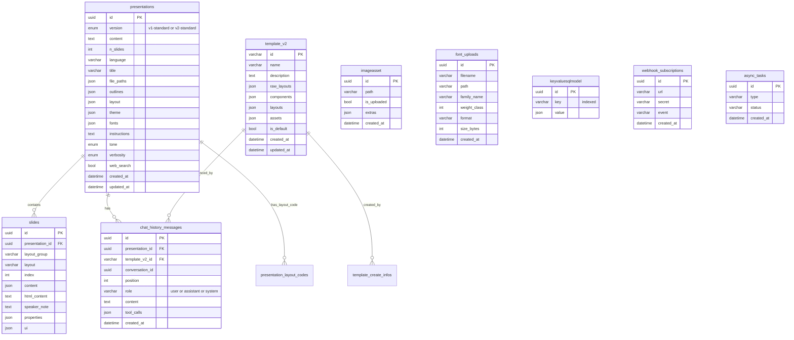

### Tables Summary

| Table | Purpose | Key Relationships |
|-------|---------|-------------------|
| `presentations` | Root presentation record | → slides, chat_history_messages |
| `slides` | Individual slide content + HTML | → presentations |
| `template_v2` | Template definitions + layouts | → chat_history_messages |
| `chat_history_messages` | Conversation history | → presentations, template_v2 |
| `imageasset` | Generated/uploaded image registry | Independent |
| `font_uploads` | Custom uploaded font metadata | Independent |
| `keyvaluesqlmodel` | Generic key-value config store | Used for user config |
| `presentation_layout_codes` | Custom Monaco layout code | → presentations |
| `template_create_infos` | Template creation audit log | → template_v2 |
| `webhook_subscriptions` | Webhook endpoint registrations | Independent |
| `async_tasks` | Background job tracking | Independent |
| `async_presentation_generation_tasks` | Generation job status | Independent |
| `ollama_pull_status` | Ollama model download progress | Independent |

> **Supported Databases:** SQLite (default), PostgreSQL, MySQL — configured via `DATABASE_URL` env var.

---

## 🤖 LLM Providers

15 providers via unified adapter pattern in `utils/llm_provider.py`:

| Provider | Config Value | Models |
|----------|-------------|--------|
|  **OpenAI** | `LLM=openai` | GPT-4o, GPT-4, o1, o3 |
|  **Anthropic** | `LLM=anthropic` | Claude 3.5 Sonnet, Claude 4 |
|  **Google Gemini** | `LLM=google` | Gemini 1.5 Pro, Gemini 2.0 Flash |
|  **Groq** | `LLM=groq` | Llama 3, Mixtral, Gemma (fast inference) |
|  **Ollama** | `LLM=ollama` | Any local model (pull API included) |
|  **DeepSeek** | `LLM=deepseek` | DeepSeek V2, DeepSeek V3 |
|  **Azure OpenAI** | `LLM=azure` | Azure-deployed GPT models |
|  **AWS Bedrock** | `LLM=bedrock` | Claude via AWS |
|  **OpenRouter** | `LLM=openrouter` | 200+ models unified API |
|  **Fireworks** | `LLM=fireworks` | Fast open-source inference |
|  **Together AI** | `LLM=together` | Open-source model hosting |
|  **Cerebras** | `LLM=cerebras` | Ultra-low latency inference |
|  **LiteLLM** | `LLM=litellm` | Proxy for 100+ providers |
|  **LMStudio** | `LLM=lmstudio` | Local OpenAI-compatible server |
|  **Custom** | `LLM=custom` | Any OpenAI-compatible endpoint |

### Image Generation Providers

| Provider | Config | Type |
|----------|--------|------|
|  **OpenAI DALL-E** | `openai` | Cloud API |
|  **ComfyUI** | `comfyui` | Self-hosted |
|  **Pexels** | `pexels` | Stock photo API |
|  **Pixabay** | `pixabay` | Stock photo API |
|  **Open WebUI** | `open-webui` | Self-hosted |
|  **OpenAI Compatible** | `openai-compatible` | Any compatible API |

### Web Search Providers

| Provider | Config |
|----------|--------|
|  **SearXNG** | `WEB_SEARCH_PROVIDER=searxng` |
|  **Tavily** | `WEB_SEARCH_PROVIDER=tavily` |
|  **Exa** | `WEB_SEARCH_PROVIDER=exa` |
|  **Brave Search** | `WEB_SEARCH_PROVIDER=brave` |
|  **Serper** | `WEB_SEARCH_PROVIDER=serper` |

---

## 🔌 MCP Server

A secondary server (`mcp_server.py`) on **port 8001** using **FastMCP**, exposing FastAPI capabilities as LLM-callable tools.

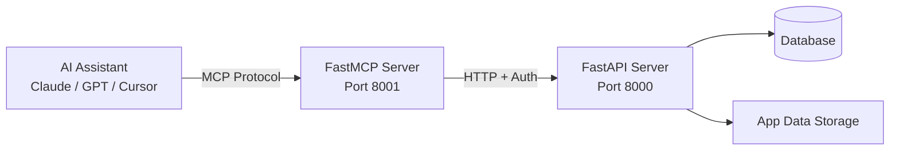

| Tool Category | Capabilities |
|---------------|-------------|
| **Presentations** | Create, generate, list, delete, duplicate |
| **Slides** | Get, update, add, delete, reorder |
| **Chat** | Stream messages with full slide context |
| **Templates** | List, create, update, delete |
| **Export** | PPTX/PDF async generation |
| **Auth and Config** | Status, session management |

> Disabled in Electron mode via `PRESENTON_ELECTRON=true`.

---

## 📡 API Reference

### Auth Endpoints

| Method | Path | Description |
|--------|------|-------------|
| `GET` | `/api/v1/auth/status` | Auth config + session status |
| `GET` | `/api/v1/auth/verify` | Verify current session token |
| `POST` | `/api/v1/auth/setup` | Create initial credentials (first-run) |
| `POST` | `/api/v1/auth/login` | Login → returns token + sets cookie |
| `POST` | `/api/v1/auth/logout` | Clear session cookie |
| `POST` | `/api/v1/auth/2fa/setup` | Generate TOTP secret + QR SVG |
| `POST` | `/api/v1/auth/2fa/verify` | Verify TOTP code |
| `POST` | `/api/v1/auth/2fa/disable` | Disable 2FA for user |
| `POST` | `/api/v1/auth/verify-email` | Verify email OTP (Resend flow) |

### Presentation Endpoints

| Method | Path | Description |
|--------|------|-------------|
| `GET` | `/api/v1/ppt/presentation/all` | List all presentations |
| `GET` | `/api/v1/ppt/presentation/{id}` | Get presentation with slides |
| `POST` | `/api/v1/ppt/presentation/create` | Create empty presentation |
| `POST` | `/api/v1/ppt/presentation/generate` | Generate full presentation (SSE) |
| `DELETE` | `/api/v1/ppt/presentation/{id}` | Delete presentation |
| `POST` | `/api/v1/ppt/presentation/{id}/duplicate` | Duplicate presentation |
| `POST` | `/api/v1/ppt/presentation/{id}/export` | Export as PPTX/PDF (async) |

### Slide Endpoints

| Method | Path | Description |
|--------|------|-------------|
| `GET` | `/api/v1/ppt/slide/{id}` | Get slide |
| `PUT` | `/api/v1/ppt/slide/{id}` | Update slide content/properties |
| `POST` | `/api/v1/ppt/slide/add` | Add new slide |
| `DELETE` | `/api/v1/ppt/slide/{id}` | Delete slide |
| `POST` | `/api/v1/ppt/slide/reorder` | Reorder slides |

### Chat Endpoints

| Method | Path | Description |
|--------|------|-------------|
| `GET` | `/api/v1/ppt/chat/conversations` | List conversations |
| `GET` | `/api/v1/ppt/chat/history` | Get conversation history |
| `POST` | `/api/v1/ppt/chat/message` | Send message (non-streaming) |
| `POST` | `/api/v1/ppt/chat/message/stream` | Send message (SSE streaming) |
| `DELETE` | `/api/v1/ppt/chat/conversation` | Delete conversation |

### Additional Endpoint Groups

| Group | Path Prefix | Purpose |
|-------|-------------|---------|
| Templates | `/api/v1/ppt/template/*` | CRUD for presentation templates |
| Images | `/api/v1/ppt/images/*` | Multi-provider image generation |
| Icons | `/api/v1/ppt/icons/*` | SVG icon search + retrieval |
| Fonts | `/api/v1/ppt/fonts/*` | Custom font upload + management |
| Files | `/api/v1/ppt/files/*` | Document upload + management |
| Outlines | `/api/v1/ppt/outlines/*` | Outline generation |
| Themes | `/api/v1/ppt/themes/*` | Theme management |
| Layouts | `/api/v1/ppt/layouts/*` | Layout management |
| LLM Providers | `/api/v1/ppt/{provider}/*` | OpenAI, Anthropic, Google, Ollama |
| Async Tasks | `/api/v1/async-tasks/*` | Background job status polling |
| Webhooks | `/api/v1/webhook/*` | Subscribe/unsubscribe |
| Hackathons | `/api/v1/hackathons/*` | Hackathon data |
| Mock | `/api/v1/mock/*` | Testing endpoints |

### BFF API Routes (Next.js)

| Route | Method | Purpose |
|-------|--------|---------|
| `/api/user-config` | GET/POST | Read/write user configuration |
| `/api/template` | GET/POST | Template operations |
| `/api/templates` | GET | List available templates |
| `/api/coach` | POST | AI coach interaction (OpenRouter 120B) |
| `/api/export-presentation` | POST | Trigger PPTX/PDF export |
| `/api/export-presentation/file` | GET | Download exported file |
| `/api/upload-image` | POST | Upload image asset |
| `/api/validate-layout-code` | POST | Validate custom Monaco layout code |
| `/api/has-required-key` | GET | Check if API keys configured |
| `/api/can-change-keys` | GET | Check key modification permission |
| `/api/telemetry-status` | GET | Mixpanel analytics opt-in status |

---

## 🚀 Deployment

### Deployment Architecture

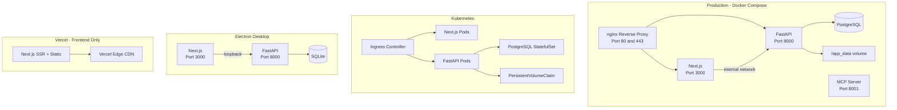

### Docker Quick Start

```bash
docker compose up -d
# Frontend: http://localhost:3000
# Backend API: http://localhost:8000
# API Docs: http://localhost:8000/docs
```

See [DOCKER.md](DOCKER.md) and [KUBERNETES.md](KUBERNETES.md) for full deployment guides.

### Environment Variables

#### Backend

| Variable | Default | Purpose |
|----------|---------|---------|
| `DATABASE_URL` | `sqlite:///app_data/fastapi.db` | Database connection string |
| `APP_DATA_DIRECTORY` | `{project}/app_data` | Upload/export/font storage |
| `MIGRATE_DATABASE_ON_STARTUP` | `false` | Auto-run Alembic migrations |
| `DISABLE_AUTH` | `true` | Disable authentication |
| `AUTH_USERNAME` | - | Auto-configure admin username |
| `AUTH_PASSWORD` | - | Auto-configure admin password |
| `AUTH_OVERRIDE_FROM_ENV` | `false` | Overwrite stored credentials |
| `RESET_AUTH` | `false` | Clear all stored credentials |
| `RESEND_API_KEY` | - | Enable email OTP on signup |
| `LLM` | - | Active LLM provider |
| `OPENAI_API_KEY` | - | OpenAI API key |
| `ANTHROPIC_API_KEY` | - | Anthropic API key |
| `GOOGLE_API_KEY` | - | Google AI API key |
| `GROQ_API_KEY` | - | Groq API key |
| `SENTRY_DSN` | - | Sentry error tracking DSN |
| `LOG_LEVEL` | `INFO` | Logging verbosity |
| `DB_POOL_SIZE` | `5` | Database connection pool size |
| `DB_MAX_OVERFLOW` | `10` | Max pool overflow connections |

#### Frontend

| Variable | Default | Purpose |
|----------|---------|---------|
| `NEXT_PUBLIC_FAST_API` | `http://127.0.0.1:8000` | Backend URL (browser-side) |
| `FAST_API_INTERNAL_URL` | - | Backend URL (server-side, Docker internal) |
| `NEXT_PUBLIC_HACKATHONS_API_URL` | - | External hackathon data API |

---

## 🛠️ Development Setup

### Prerequisites

| Tool | Version | Purpose |
|------|---------|---------|
| **Node.js** | 20+ | Frontend runtime |
| **Python** | 3.11 | Backend runtime |
| **uv** | latest | Fast Python package manager |
| **npm** | latest | Frontend package manager |

### 1. Backend

```bash
cd backend
uv sync
cp .env.example .env
# Edit .env with your LLM API keys
uv run python server.py --port 8000 --reload true
```

> API docs available at: `http://127.0.0.1:8000/docs`

**Windows (restricted environments):**

```powershell
cd backend
.\.venv\Scripts\python.exe server.py --port 8000 --reload true
```

### 2. Frontend

```bash
cd frontend
npm install
echo "NEXT_PUBLIC_FAST_API=http://127.0.0.1:8000" > .env.local
npm run dev
```

> App available at: `http://localhost:3000`

### 3. App Builder CLI (Optional)

```bash
cd app_builder
pip install -r requirements-runtime.txt
python tui.py
# Or instantly via npm:
npx hackit-ai
```

### Running Tests

```bash
cd backend
uv run pytest                # All tests
uv run pytest --cov          # With coverage report
uv run pytest tests/unit/    # Unit tests only
```

### Database Migrations

```bash
cd backend
alembic revision --autogenerate -m "description"
alembic upgrade head
alembic downgrade -1         # Rollback one version
```

### Middleware Stack

| Order | Middleware | Purpose |
|-------|-----------|---------|
| 1 | **CORS** | Restrict origins (configured URL or * in dev) |
| 2 | **UserConfigEnvUpdate** | Injects user-config keys into env per request |
| 3 | **SessionAuth** | Validates HMAC tokens on all /api/* paths |
| 4 | **Static Icon Fallback** | Returns placeholder SVG for missing icon paths |

### Backend Startup Sequence

```
1. Configure logging (LOG_LEVEL env, default INFO)
2. Create APP_DATA_DIRECTORY if not exists
3. Run Alembic migrations (MIGRATE_DATABASE_ON_STARTUP=true)
4. Create any missing database tables
5. Import 5 default presentation templates
6. Bootstrap auth from env (AUTH_USERNAME / AUTH_PASSWORD)
7. Sync env with user config store
8. Check LLM + image provider API key availability
```

---

<div align="center">

---

### ⭐ Built for Hackathons. Designed for Winners.

**Made with ❤️ by AC-DC for Summer of Codefest 2.0**

[](https://github.com/Rachit-Tiwari-7/HACKIT-AI)
[](https://www.npmjs.com/package/hackit-ai)

</div>
