# Hack-It Ai

<p align="center">
  
</p>

AI-powered presentation generation platform. Input a prompt or upload documents, and the system generates professional slide decks via multiple LLM providers, with a full-featured slide editor and PPTX/PDF export.

---

## Table of Contents

- [System Architecture](#system-architecture)
- [Tech Stack](#tech-stack)
- [Project Structure](#project-structure)
- [Frontend Architecture](#frontend-architecture)
- [Backend Architecture](#backend-architecture)
- [Data Flow](#data-flow)
- [Database Schema](#database-schema)
- [API Reference](#api-reference)
- [Authentication](#authentication)
- [LLM Providers](#llm-providers)
- [Deployment](#deployment)
- [Development Setup](#development-setup)

---

## System Architecture

### High-Level Overview

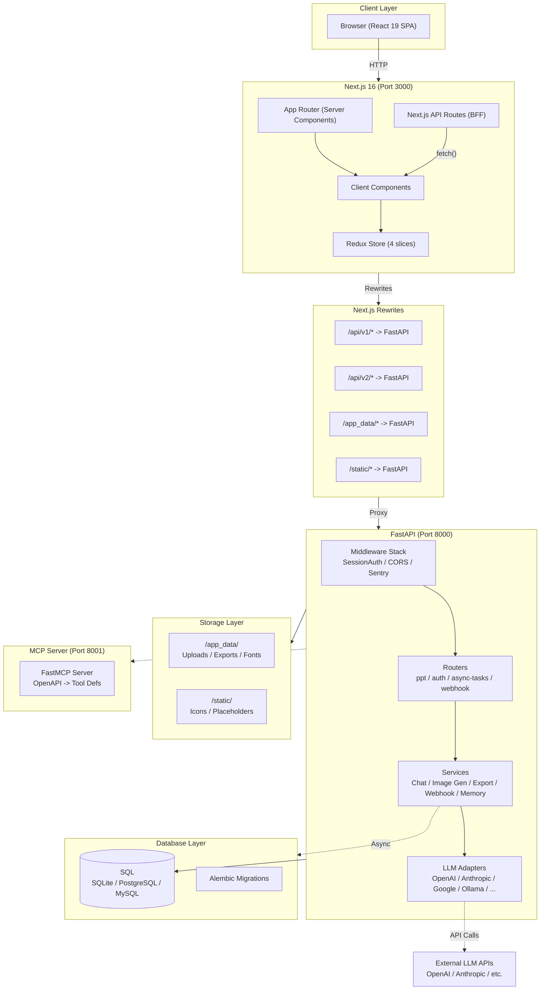

### Request Lifecycle (Presentation Generation)

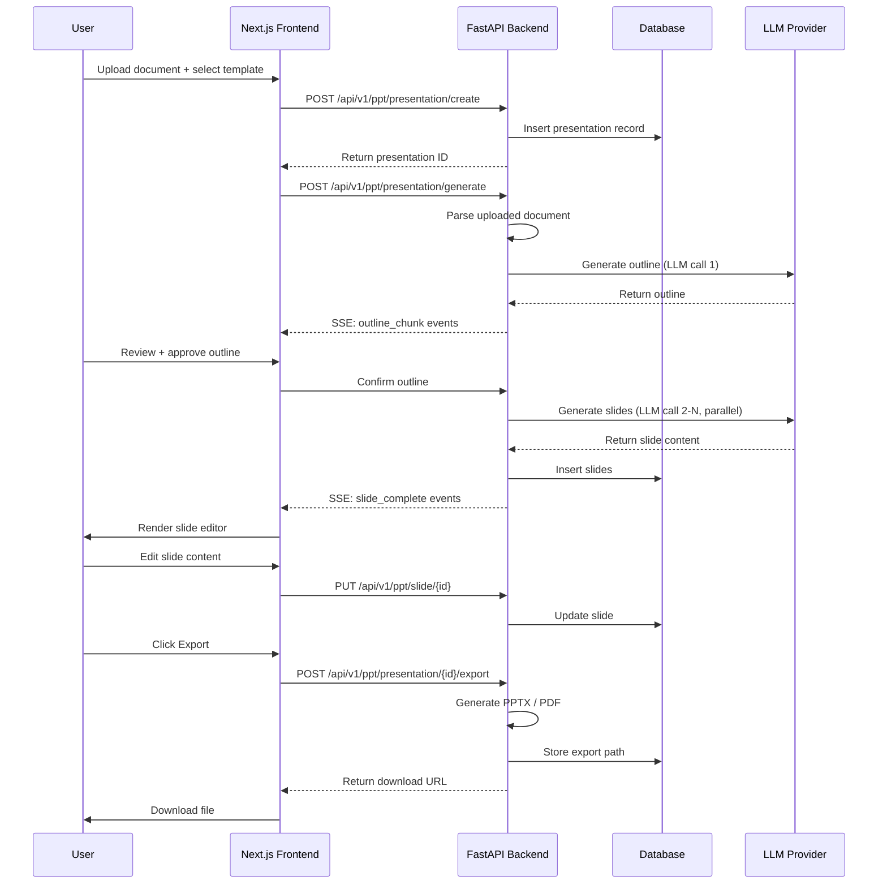

### Frontend Component Tree

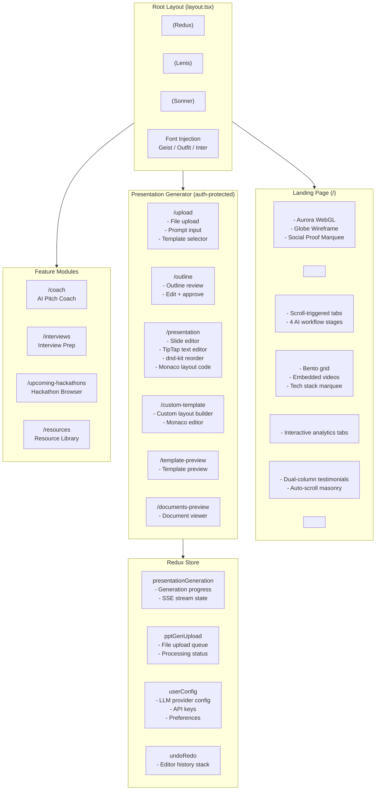

---

## Tech Stack

### Frontend

| Category | Technology | Version |
|----------|-----------|---------|
| Framework | Next.js (App Router) | 16.2.10 |
| Language | TypeScript | 5.x |
| UI Library | React | 19.2.4 |
| Styling | Tailwind CSS | 4.x |
| Component System | shadcn/ui (Radix primitives) | base-nova style |
| State Management | Redux Toolkit | 2.2.8 |
| Server State | TanStack React Query + SWR | 5.x / 2.x |
| Text Editor | TipTap (ProseMirror) | 2.x |
| Drag & Drop | dnd-kit | 6.x / 10.x |
| Animation | Framer Motion + GSAP + Lenis | 12.x / 3.15 / 1.3 |
| 3D / WebGL | ogl + react-konva + d3 | 1.x / 19.x / 7.x |
| Charts | Chart.js + Recharts + Mermaid | 4.x / 3.x / 11.x |
| Code Editor | Monaco Editor | 4.x |
| Form Validation | Zod | 4.x |
| Icons | Lucide React + Phosphor Icons | latest |
| Fonts | Geist + Outfit + Inter (next/font) | latest |
| Voice AI | Vapi AI (Web SDK) | 2.x |
| Analytics | Mixpanel | latest |
| Notifications | Sonner | 2.x |

### Backend

| Category | Technology | Version |
|----------|-----------|---------|
| Runtime | Python | 3.11 |
| Web Framework | FastAPI (ASGI) | 0.116+ |
| Server | Uvicorn | latest |
| ORM | SQLModel (SQLAlchemy + Pydantic) | 0.0.24 |
| Migrations | Alembic | 1.14+ |
| Database (default) | SQLite (aiosqlite) | built-in |
| Database (prod) | PostgreSQL (asyncpg) or MySQL (aiomysql) | configurable |
| LLM Integration | OpenAI + Anthropic + Google + Groq + Ollama + 10 more | various |
| Image Generation | DALL-E + ComfyUI + Pexels + Pixabay + Open WebUI | various |
| Vector Store | FastEmbed (local embeddings) | 0.5.2 |
| Memory | mem0ai (OSS long-term memory) | 0.1.115+ |
| Web Search | SearXNG / Tavily / Exa / Brave / Serper | various |
| Document Parsing | pdfplumber + python-pptx + Pillow + fonttools | latest |
| MCP Protocol | FastMCP | 2.11+ |
| Auth | Custom PBKDF2-HMAC-SHA256 session tokens | custom |
| Error Tracking | Sentry SDK (optional) | latest |
| Testing | pytest + pytest-cov | 9.x / 7.x |

---

## Project Structure

```
SCOF-main/
│
├── frontend/                              # Next.js 16 application
│   ├── src/
│   │   ├── app/                           # App Router
│   │   │   ├── layout.tsx                 # Root layout
│   │   │   ├── page.tsx                   # Landing page
│   │   │   ├── providers.tsx              # Redux Provider wrapper
│   │   │   ├── globals.css                # Tailwind v4 + global styles
│   │   │   ├── ConfigurationInitializer.tsx
│   │   │   ├── ChatGptAuthRedirectHandler.tsx
│   │   │   ├── MixpanelInitializer.tsx
│   │   │   │
│   │   │   ├── (presentation-generator)/  # Auth-protected presentation routes
│   │   │   │   ├── upload/               # Document upload + prompt input
│   │   │   │   ├── outline/              # AI-generated outline review
│   │   │   │   ├── presentation/         # Full slide editor
│   │   │   │   ├── documents-preview/    # Uploaded document viewer
│   │   │   │   ├── template-preview/     # Template browser
│   │   │   │   ├── custom-template/      # Custom layout builder (Monaco)
│   │   │   │   └── services/api/         # API service layer
│   │   │   │
│   │   │   ├── signup/                   # Auth pages
│   │   │   ├── coach/                    # AI pitch coach
│   │   │   ├── interviews/               # Interview preparation
│   │   │   ├── upcoming-hackathons/      # Hackathon browser
│   │   │   ├── resources/                # Resource library
│   │   │   ├── (export)/pdf-maker/       # PDF export
│   │   │   └── api/                      # BFF API route handlers
│   │   │
│   │   ├── components/
│   │   │   ├── ui/                       # shadcn/ui primitives (button, card, dialog, etc.)
│   │   │   ├── landing/                  # Landing page sections
│   │   │   ├── auth/                     # Login/setup forms
│   │   │   ├── slide-editor/             # Slide editor + toolbar + text
│   │   │   ├── coach/                    # AI coach components
│   │   │   ├── interview/               # Interview components
│   │   │   ├── hackathons/              # Hackathon card/browser components
│   │   │   ├── OnBoarding/              # First-run onboarding
│   │   │   └── analytics/               # Usage analytics widgets
│   │   │
│   │   ├── store/
│   │   │   ├── store.ts                 # configureStore
│   │   │   └── slices/
│   │   │       ├── presentationGeneration.ts
│   │   │       ├── presentationGenUpload.ts
│   │   │       ├── userConfig.ts
│   │   │       └── undoRedoSlice.ts
│   │   │
│   │   ├── hooks/                       # Custom React hooks
│   │   ├── lib/                         # Utilities (template compilation, validation, SVG)
│   │   ├── services/                    # Service clients (coach, groq)
│   │   ├── types/                       # TypeScript definitions
│   │   ├── utils/                       # API client, auth, constants, analytics
│   │   └── styles/                      # Additional CSS files
│   │
│   ├── templates/                       # Presentation templates (5 variants)
│   │   ├── swift/
│   │   ├── standard/
│   │   ├── modern/
│   │   ├── dynamic/
│   │   └── general/
│   │
│   ├── public/                          # Static assets (images, videos, SVGs)
│   ├── layouts.json                     # Slide layout definitions (shared with backend)
│   ├── next.config.ts                   # Next.js config + API rewrites
│   └── package.json
│
├── backend/                             # FastAPI Python backend
│   ├── api/
│   │   ├── main.py                      # App factory + middleware + router registration
│   │   ├── lifespan.py                  # Startup/shutdown lifecycle
│   │   ├── middlewares.py               # SessionAuth + UserConfigEnv middleware
│   │   └── v1/
│   │       ├── auth/
│   │       │   └── router.py           # /auth/* endpoints
│   │       ├── ppt/
│   │       │   ├── router.py           # Router aggregator
│   │       │   └── endpoints/          # 23 endpoint modules
│   │       ├── async_tasks/
│   │       │   └── router.py
│   │       ├── webhook/
│   │       │   └── router.py
│   │       └── mock/
│   │           └── router.py
│   │
│   ├── models/
│   │   ├── sql/                        # 14 SQLModel ORM tables
│   │   └── ...                         # Pydantic request/response models
│   │
│   ├── services/                       # Business logic layer
│   │   ├── database.py                # Engine + session factory
│   │   ├── chat/                      # Chat message handling + memory
│   │   ├── image_generation_service.py # Multi-provider image gen
│   │   ├── icon_finder_service.py     # Icon search from local store
│   │   ├── document_conversion_service.py
│   │   ├── export_task_service.py     # PPTX/PDF export jobs
│   │   ├── webhook_service.py
│   │   ├── mem0_oss_memory.py         # Long-term LLM memory
│   │   ├── office_document_service.py
│   │   └── liteparse_service.py
│   │
│   ├── templates/                      # Presentation rendering engine
│   │   ├── v2/                        # Template v2 schema
│   │   ├── handler.py                 # Main template handler
│   │   ├── providers.py               # LLM-powered template generation
│   │   └── slide_layout_jobs.py       # Layout rendering pipeline
│   │
│   ├── utils/                         # Utility modules
│   │   ├── simple_auth.py             # PBKDF2 + HMAC auth logic
│   │   ├── llm_provider.py            # LLM provider factory
│   │   ├── llm_calls/                 # Per-provider call implementations
│   │   ├── oauth/                     # OAuth integrations
│   │   ├── sse.py                     # Server-Sent Events helpers
│   │   └── ...                        # 35+ utility modules
│   │
│   ├── constants/                     # App-wide constants
│   ├── enums/                         # llm_provider, tone, verbosity, etc.
│   ├── alembic/                       # Migration versions
│   ├── tests/                         # pytest (unit / integration / regression)
│   ├── static/                        # Built-in icons and images
│   ├── assets/                        # Icon JSON stores
│   ├── scripts/                       # Utility scripts
│   │
│   ├── server.py                      # Uvicorn entrypoint
│   ├── mcp_server.py                  # FastMCP server (port 8001)
│   ├── migrations.py                  # Migrate-on-startup runner
│   ├── pyproject.toml
│   └── alembic.ini
│
├── CLAUDE.md
├── .gitignore
└── README.md
```

---

## Frontend Architecture

### Route Map

| Route Group | Path | Component | Purpose |
|-------------|------|-----------|---------|
| Public | `/` | `page.tsx` | Landing page (server-rendered) |
| Public | `/signup` | Signup page | Authentication / onboarding |
| Protected | `/upload` | Upload page | File upload + prompt + template selection |
| Protected | `/outline` | Outline page | AI outline review + editing |
| Protected | `/presentation` | Presentation page | Slide editor (TipTap, dnd-kit, Monaco) |
| Protected | `/documents-preview` | Document preview | Uploaded document viewer |
| Protected | `/template-preview` | Template preview | Template layout browser |
| Protected | `/custom-template` | Custom template | Monaco-based layout builder |
| Protected | `/pdf-maker` | PDF export | Export configuration |
| Protected | `/coach` | AI coach | AI pitch coaching interface |
| Protected | `/interviews` | Interview prep | Interview question generator |
| Protected | `/upcoming-hackathons` | Hackathon browser | Hackathon listing with filters |
| Protected | `/resources` | Resource library | Educational content |

### State Management (Redux Toolkit)

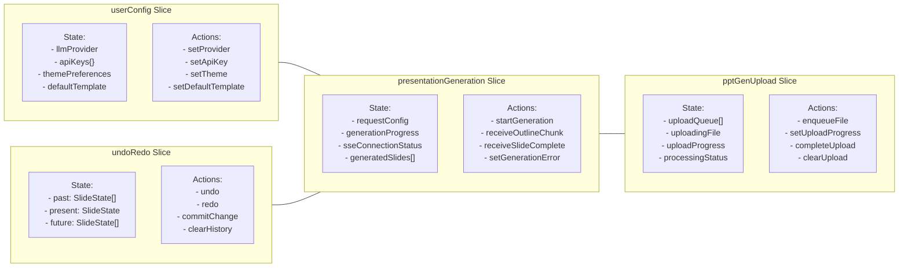

### BFF API Routes

Next.js Route Handlers at `src/app/api/` provide a backend-for-frontend layer:

| Route | Method | Purpose |
|-------|--------|---------|
| `/api/user-config` | GET/POST | Read/write user configuration |
| `/api/template` | GET/POST | Template operations |
| `/api/templates` | GET | List available templates |
| `/api/template/custom` | POST | Custom template CRUD |
| `/api/save-layout` | POST | Persist slide layout |
| `/api/export-presentation` | POST | Trigger PPTX/PDF export |
| `/api/export-presentation/file` | GET | Download exported file |
| `/api/export-presentation-data/[id]` | GET | Get export metadata |
| `/api/upload-image` | POST | Upload image asset |
| `/api/read-file` | POST | Read uploaded file contents |
| `/api/coach` | POST | AI coach interaction |
| `/api/validate-layout-code` | POST | Validate custom layout code |
| `/api/has-required-key` | GET | Check if API keys are configured |
| `/api/can-change-keys` | GET | Check if user can modify keys |
| `/api/telemetry-status` | GET | Telemetry opt-in status |

### API Proxy (Next.js Rewrites)

In `next.config.ts`, all requests to matching paths are proxied to the FastAPI backend:

```
/api/v1/*              ->  {fastApiUrl}/api/v1/*
/api/v2/*              ->  {fastApiUrl}/api/v2/*
/app_data/*            ->  {fastApiUrl}/app_data/*
/static/*              ->  {fastApiUrl}/static/*
```

Backend URL resolution:
1. `FAST_API_INTERNAL_URL` (Docker internal networking)
2. `NEXT_PUBLIC_FAST_API` (Electron / browser)
3. Fallback: `http://127.0.0.1:8000`

---

## Backend Architecture

### Application Factory (api/main.py)

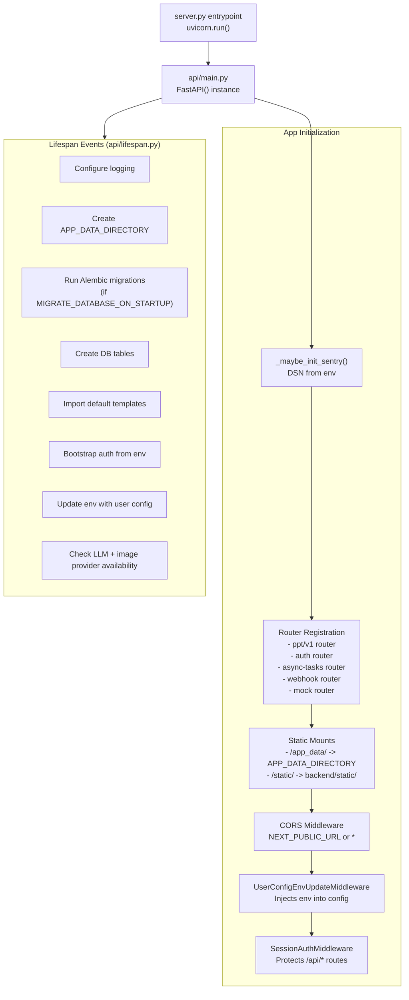

### Services Layer

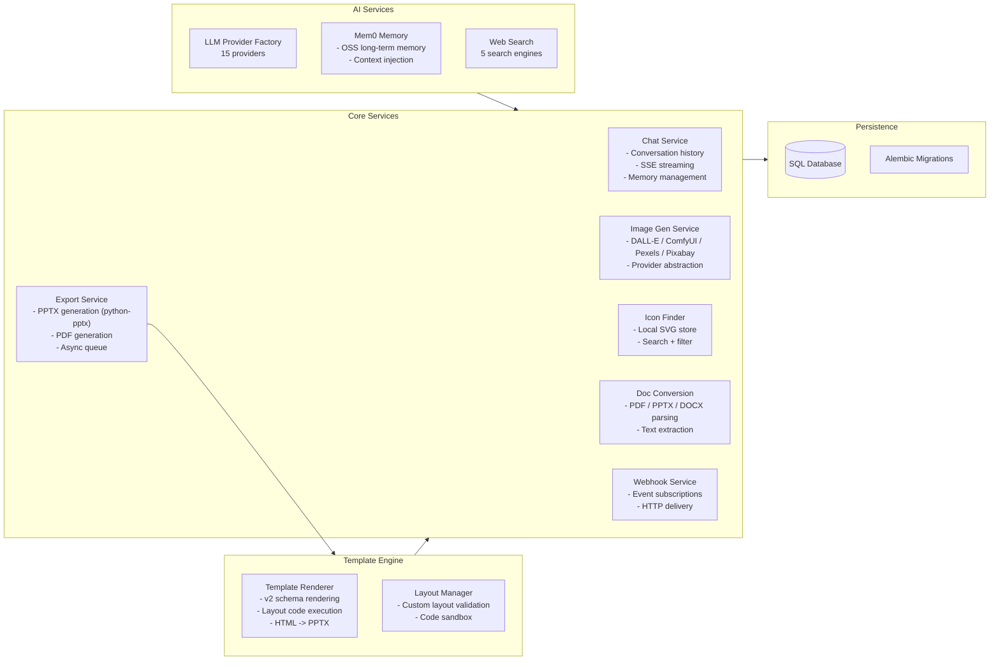

### Middleware Stack

| Order | Middleware | File | Purpose |
|-------|-----------|------|---------|
| 1 | CORS | `api/main.py` | Restrict origins to configured URL or allow all in dev |
| 2 | UserConfigEnvUpdate | `api/middlewares.py` | Injects user-config keys into env for each request |
| 3 | SessionAuth | `api/middlewares.py` | Validates session tokens on all /api/* paths, exempts /auth/* |
| 4 | Static Icon Fallback | `api/main.py` | Returns placeholder SVG for missing icon paths (404 catch) |

### Startup Sequence (Lifespan)

```
1. Configure logging (LOG_LEVEL env, default INFO)
2. Create APP_DATA_DIRECTORY if not exist
3. Run Alembic migrations (if MIGRATE_DATABASE_ON_STARTUP=true)
4. Create any missing database tables
5. Import default presentation templates
6. Bootstrap auth from env (if AUTH_USERNAME/AUTH_PASSWORD set)
7. Sync env with user config
8. Check LLM + image provider API key / model availability
```

---

## Data Flow

### Presentation Generation Pipeline

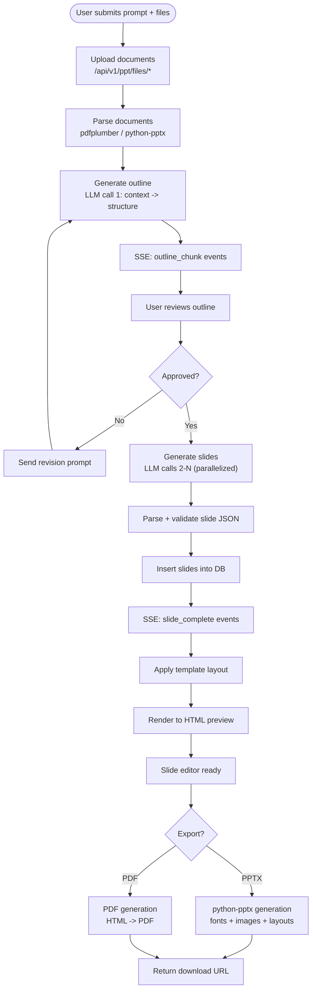

### Chat with Presentation

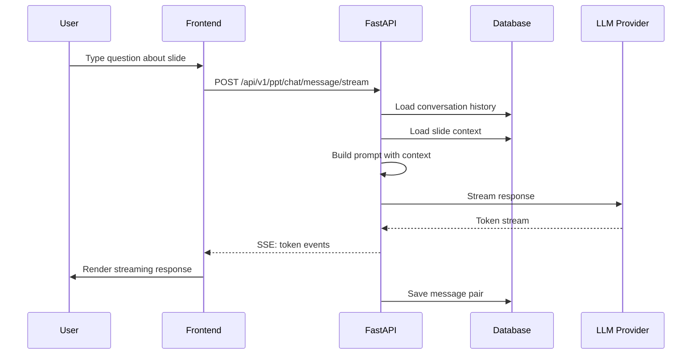

---

## Database Schema

### Entity-Relationship Diagram

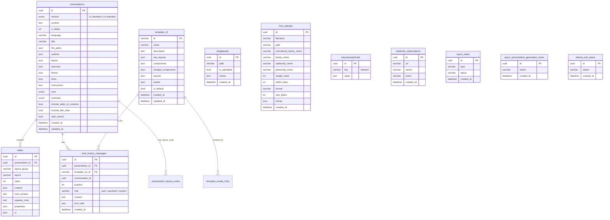

### Tables Summary

| Table | Records | Key Relationships |
|-------|---------|-------------------|
| `presentations` | Presentation root | FK -> slides, chat_history_messages |
| `slides` | Individual slides | FK -> presentations |
| `template_v2` | Template definitions | FK -> chat_history_messages |
| `chat_history_messages` | Conversation messages | FK -> presentations, template_v2 |
| `imageasset` | Generated/uploaded images | Independent |
| `font_uploads` | Custom fonts | Independent |
| `keyvaluesqlmodel` | Generic key-value store | Used for user config, metadata |
| `presentation_layout_codes` | Custom layout code | FK -> presentations |
| `template_create_infos` | Template creation metadata | FK -> template_v2 |
| `webhook_subscriptions` | Webhook registrations | Independent |
| `async_tasks` | Background job tracking | Independent |
| `async_presentation_generation_tasks` | Generation job status | Independent |
| `ollama_pull_status` | Ollama model download | Independent |

Database: SQLite (default), PostgreSQL, or MySQL. Configured via `DATABASE_URL`.

---

## API Reference

### Auth Endpoints

```
GET    /api/v1/auth/status      -> Auth config + session status
GET    /api/v1/auth/verify      -> Verify current session token
POST   /api/v1/auth/setup       -> Create initial credentials (first-run)
POST   /api/v1/auth/login       -> Login, returns token + sets cookie
POST   /api/v1/auth/logout      -> Clear session
```

### Presentation Endpoints

```
GET    /api/v1/ppt/presentation/all                  -> List presentations
GET    /api/v1/ppt/presentation/{id}                 -> Get presentation with slides
POST   /api/v1/ppt/presentation/create               -> Create empty presentation
POST   /api/v1/ppt/presentation/generate             -> Generate full presentation (SSE)
DELETE /api/v1/ppt/presentation/{id}                 -> Delete presentation
POST   /api/v1/ppt/presentation/{id}/duplicate       -> Duplicate presentation
POST   /api/v1/ppt/presentation/{id}/export          -> Export as PPTX/PDF (async)
```

### Slide Endpoints

```
GET    /api/v1/ppt/slide/{id}        -> Get slide
PUT    /api/v1/ppt/slide/{id}        -> Update slide content/properties
POST   /api/v1/ppt/slide/add         -> Add new slide
DELETE /api/v1/ppt/slide/{id}        -> Delete slide
POST   /api/v1/ppt/slide/reorder     -> Reorder slides
```

### Chat Endpoints

```
GET    /api/v1/ppt/chat/conversations          -> List conversations
GET    /api/v1/ppt/chat/history                -> Get conversation history
POST   /api/v1/ppt/chat/message                -> Send message (non-streaming)
POST   /api/v1/ppt/chat/message/stream         -> Send message (SSE streaming)
DELETE /api/v1/ppt/chat/conversation           -> Delete conversation
```

### Template Endpoints

```
GET    /api/v1/ppt/template/all          -> List all templates
GET    /api/v1/ppt/template/{id}         -> Get template detail
POST   /api/v1/ppt/template/create       -> Create custom template
PUT    /api/v1/ppt/template/{id}         -> Update template
DELETE /api/v1/ppt/template/{id}         -> Delete template
```

### LLM Provider Endpoints

```
POST   /api/v1/ppt/openai/...            -> OpenAI-specific operations
POST   /api/v1/ppt/anthropic/...         -> Anthropic Claude operations
POST   /api/v1/ppt/google/...            -> Google Gemini operations
POST   /api/v1/ppt/ollama/...            -> Ollama model management
```

### Other Endpoints

```
/api/v1/ppt/images/*          -> Image generation + management
/api/v1/ppt/icons/*           -> Icon search + retrieval
/api/v1/ppt/fonts/*           -> Font upload + management
/api/v1/ppt/files/*           -> File upload + management
/api/v1/ppt/outlines/*        -> Outline generation + management
/api/v1/ppt/themes/*          -> Theme management
/api/v1/ppt/layouts/*         -> Layout management
/api/v1/ppt/pptx-slides/*     -> PPTX slide extraction
/api/v1/ppt/pdf-slides/*      -> PDF slide extraction
/api/v1/ppt/prompts/*         -> Prompt management
/api/v1/ppt/codex-auth/*      -> Codex OAuth flow
/api/v1/async-tasks/*         -> Async task status
/api/v1/webhook/*             -> Webhook subscribe/unsubscribe
/api/v1/mock/*                -> Mock endpoints for testing
```

---

## Authentication

### Auth Flow

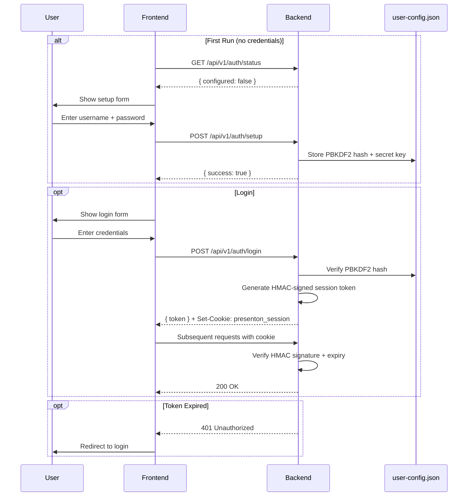

### Auth Implementation

| Component | Detail |
|-----------|--------|
| Password Hashing | PBKDF2-HMAC-SHA256, 200,000 iterations, 16-byte random salt |
| Session Token | HMAC-SHA256 signed payload: `{v:1, u:username, iat, exp}` |
| Token Expiry | 30 days from issue |
| Transport | HTTP-only cookie (`presenton_session`) or `Authorization: Bearer <token>` |
| Fallback | `Authorization: Basic <base64>` for service-to-service calls |
| Storage | `user-config.json` in `APP_DATA_DIRECTORY` |

### Auth Modes (env-controlled)

| Mode | Variables | Behavior |
|------|-----------|----------|
| Disabled | `DISABLE_AUTH=true` | No auth required (default, for Electron desktop) |
| Enabled | `DISABLE_AUTH=false` | Login/setup flow active |
| Auto-Setup | `AUTH_USERNAME` + `AUTH_PASSWORD` | Creates credentials at startup |
| Override | `AUTH_OVERRIDE_FROM_ENV=true` | Overwrites existing stored credentials |
| Reset | `RESET_AUTH=true` | Clears all stored credentials |

### Protected Paths

The `SessionAuthMiddleware` protects:
- All `/api/*` routes (except `/api/v1/auth/*`)
- `/docs`, `/openapi.json`, `/redoc`

Public (exempt):
- `/api/v1/auth/*` (login, setup, status)
- `/app_data/images/*`
- `/app_data/fonts/*`
- `/app_data/pptx-to-html/*`

---

## LLM Providers

15 LLM providers supported through a unified adapter:

| Provider | Config Value | Models |
|----------|-------------|--------|
| OpenAI | `LLM=openai` | GPT-4o, GPT-4, o1, o3 |
| Anthropic | `LLM=anthropic` | Claude 3.5 Sonnet, Claude 3.5 Haiku, Claude 4 |
| Google Gemini | `LLM=google` | Gemini 1.5 Pro, Gemini 1.5 Flash, Gemini 2.0 |
| Groq | `LLM=groq` | Llama 3, Mixtral, Gemma (fast inference) |
| Ollama | `LLM=ollama` | Any local model (pull API included) |
| DeepSeek | `LLM=deepseek` | DeepSeek V2, DeepSeek V3 |
| Azure OpenAI | `LLM=azure` | Azure-deployed GPT models |
| AWS Bedrock | `LLM=bedrock` | Claude via AWS |
| OpenRouter | `LLM=openrouter` | 200+ models unified API |
| Fireworks | `LLM=fireworks` | Fast inference on open models |
| Together AI | `LLM=together` | Open-source model hosting |
| Cerebras | `LLM=cerebras` | Ultra-low latency inference |
| LiteLLM | `LLM=litellm` | Proxy for 100+ providers |
| LMStudio | `LLM=lmstudio` | Local OpenAI-compatible server |
| Custom | `LLM=custom` | Any OpenAI-compatible endpoint |

### Image Generation Providers

| Provider | Config | Type |
|----------|--------|------|
| OpenAI DALL-E | Image provider = `openai` | Cloud |
| ComfyUI | Image provider = `comfyui` | Self-hosted |
| Pexels | Image provider = `pexels` | Stock photo API |
| Pixabay | Image provider = `pixabay` | Stock photo API |
| Open WebUI | Image provider = `open-webui` | Self-hosted |
| OpenAI Compatible | Image provider = `openai-compatible` | Any API |

### Web Search Providers

| Provider | Config |
|----------|--------|
| SearXNG | `WEB_SEARCH_PROVIDER=searxng` |
| Tavily | `WEB_SEARCH_PROVIDER=tavily` |
| Exa | `WEB_SEARCH_PROVIDER=exa` |
| Brave Search | `WEB_SEARCH_PROVIDER=brave` |
| Serper | `WEB_SEARCH_PROVIDER=serper` |

---

## MCP Server

A secondary server (`mcp_server.py`) runs on port 8001 using FastMCP. It converts the FastAPI OpenAPI specification into LLM-callable tool definitions, enabling AI assistants to interact with the platform programmatically.

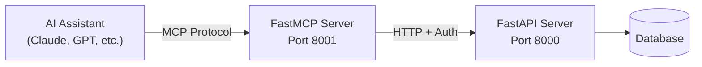

MCP exposes tools for:
- Creating and generating presentations
- Chatting with a presentation
- Listing and managing templates
- Exporting to PPTX/PDF
- Managing auth and configuration

Disabled in Electron mode (`PRESENTON_ELECTRON=true`).

---

## Deployment

### Deployment Architecture

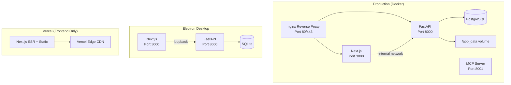

### Environment Variables

#### Backend

| Variable | Default | Purpose |
|----------|---------|---------|
| `DATABASE_URL` | `sqlite:///{app_data}/fastapi.db` | Database connection string |
| `APP_DATA_DIRECTORY` | `{project}/app_data` | Upload/export/font storage path |
| `MIGRATE_DATABASE_ON_STARTUP` | `false` | Auto-run migrations on startup |
| `DISABLE_AUTH` | `true` | Disable authentication |
| `AUTH_USERNAME` | - | Auto-configure admin username |
| `AUTH_PASSWORD` | - | Auto-configure admin password |
| `LLM` | - | Active LLM provider |
| `OPENAI_API_KEY` | - | OpenAI API key |
| `ANTHROPIC_API_KEY` | - | Anthropic API key |
| `GOOGLE_API_KEY` | - | Google AI API key |
| `SENTRY_DSN` | - | Sentry error tracking DSN |
| `LOG_LEVEL` | `INFO` | Logging verbosity |
| `DB_POOL_SIZE` | `5` | Database connection pool size |
| `DB_MAX_OVERFLOW` | `10` | Max pool overflow connections |

#### Frontend

| Variable | Default | Purpose |
|----------|---------|---------|
| `NEXT_PUBLIC_FAST_API` | `http://127.0.0.1:8000` | Backend URL (browser-side) |
| `FAST_API_INTERNAL_URL` | - | Backend URL (server-side, Docker) |
| `NEXT_PUBLIC_HACKATHONS_API_URL` | - | External hackathon data API |

---

## Development Setup

### Prerequisites

- Node.js 20+
- Python 3.11
- npm or pnpm
- uv (Python package manager)

### Backend

```bash
cd backend

# Install dependencies
uv sync

# Run server
uv run python server.py --port 8000 --reload true
```

API docs available at `http://127.0.0.1:8000/docs`.

### Frontend

```bash
cd frontend

# Install dependencies
npm install

# Run dev server
npm run dev
```

Opens at `http://localhost:3000`. API requests are proxied to the backend.

### Environment Configuration

Create `frontend/.env.local`:

```env
# Point to running backend
NEXT_PUBLIC_FAST_API=http://127.0.0.1:8000
```

### Running Tests

```bash
cd backend
uv run pytest
```

### Database Migrations

Auto-run on startup when `MIGRATE_DATABASE_ON_STARTUP=true`. Manual:

```bash
cd backend
alembic revision --autogenerate -m "description"
alembic upgrade head
```


---

Made by AC-DC for Summer of Codefest 2.0
