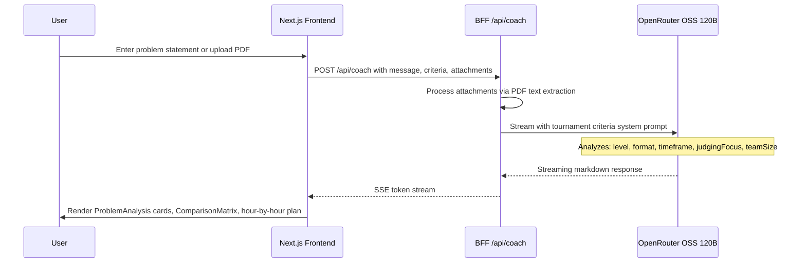
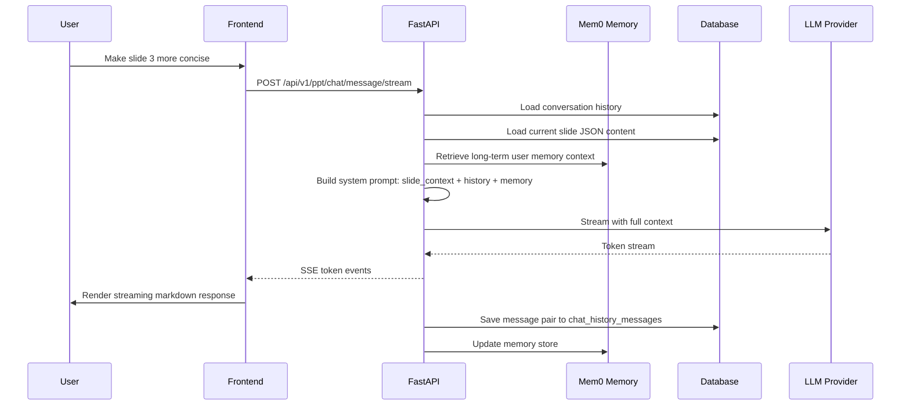

<div align="center">


# 🚀 HACK-IT AI

### *The Ultimate AI-Powered Hackathon Intelligence Platform*

> **From idea to pitch-ready presentation in minutes — powered by a Multi-Agent Orchestration Engine**

---

[](https://nextjs.org)
[](https://fastapi.tiangolo.com)
[](https://python.org)
[](https://www.typescriptlang.org)
[](https://react.dev)
[](https://openai.com)
[](https://anthropic.com)
[](https://gemini.google.com)
[](https://groq.com)
[](https://ollama.com)
[](https://docker.com)
[](https://kubernetes.io)
[](https://sqlite.org)
[](https://postgresql.org)
[](https://tailwindcss.com)
[](https://redux-toolkit.js.org)
[](https://framer.com/motion)
[](https://microsoft.github.io/monaco-editor)
[](#-authentication--2fa)
[](#two-factor-authentication-2fa)
[](#email-otp-verification-via-resend)
[](https://mem0.ai)
[](#-mcp-server)
[](https://fastembed.net)
[](#workflow-3----ai-interview-preparation)
[](https://www.npmjs.com/package/hackit-ai)
[](https://pytest.org)
[](https://sentry.io)
[](https://mixpanel.com)
[](https://alembic.sqlalchemy.org)
[](LICENSE)

</div>

---

## 📽️ Platform Demos

> All 6 demos autoplay — covering every major platform feature.

<table>
  <tr>
    <td align="center" width="50%">
      <b>🎬 Presentation Generator</b><br/>
      <video src="frontend/public/ppt-demo.mp4" autoplay loop muted playsinline width="100%"></video>
      <br/><sub>AI slide deck creation from prompt or document upload</sub>
    </td>
    <td align="center" width="50%">
      <b>🤖 AI Hackathon Coach</b><br/>
      <video src="frontend/public/hack-coach-demo.mp4" autoplay loop muted playsinline width="100%"></video>
      <br/><sub>Strategic advisor powered by OpenRouter OSS 120B</sub>
    </td>
  </tr>
  <tr>
    <td align="center" width="50%">
      <b>🎙️ AI Interview Prep</b><br/>
      <video src="frontend/public/ai-interview-demo.mp4" autoplay loop muted playsinline width="100%"></video>
      <br/><sub>Voice-enabled mock interviews with real-time AI feedback</sub>
    </td>
    <td align="center" width="50%">
      <b>🏆 Hackathons and Resources</b><br/>
      <video src="frontend/public/hacakthon-video.mp4" autoplay loop muted playsinline width="100%"></video>
      <br/><sub>Live hackathon browser with filters and resource library</sub>
    </td>
  </tr>
  <tr>
    <td align="center" width="50%">
      <b>⚡ AI Workflow Builder</b><br/>
      <video src="frontend/public/Ai-automation.mp4" autoplay loop muted playsinline width="100%"></video>
      <br/><sub>Visual drag-and-drop multi-agent workflow designer</sub>
    </td>
    <td align="center" width="50%">
      <b>💬 Chat UI and Slide Editor</b><br/>
      <video src="frontend/public/chat-ui-video.mp4" autoplay loop muted playsinline width="100%"></video>
      <br/><sub>Real-time SSE streaming chat with context-aware slide editing</sub>
    </td>
  </tr>
</table>

---

## 📋 Table of Contents

| Section | Description |
|---------|-------------|
| [🧠 Multi-Agent Orchestration](#-multi-agent-orchestration-engine) | Core AI agent pipeline and autonomous builder |
| [✨ 6 AI Workflows](#-6-ai-workflows) | Every AI-powered pipeline in detail |
| [🏛️ System Architecture](#-system-architecture) | High-level overview, request lifecycle, component tree |
| [🔐 Authentication and 2FA](#-authentication--2fa) | Custom PBKDF2 + TOTP 2FA + email OTP |
| [⚡ Tech Stack](#-tech-stack) | Full frontend, backend, infra technology tables |
| [📁 Project Structure](#-project-structure) | Complete directory map |
| [🗄️ Database Schema](#-database-schema) | ER diagram + 13 tables documented |
| [🤖 LLM Providers](#-llm-providers) | 15 LLM + 6 image + 5 search providers |
| [🔌 MCP Server](#-mcp-server) | FastMCP AI tool bridge |
| [📡 API Reference](#-api-reference) | All REST endpoints |
| [🚀 Deployment](#-deployment) | Docker, Kubernetes, Vercel, Electron |
| [🛠️ Development Setup](#-development-setup) | Local dev quickstart |
---

## 🧠 Multi-Agent Orchestration Engine

> **HACKIT** ships with a complete autonomous multi-agent system (`app_builder/`) — a React/Ink TUI that orchestrates **6 specialized AI agents** to take a hackathon idea from concept to a fully-built, scored, and pitch-ready full-stack project.


### Agent Specifications

| Agent | Spec File | Role | Output |
|-------|-----------|------|--------|
| **Coach Agent** | `agents/coach.md` | Planning, scope definition, architecture design | PLAN.md, ARCHITECTURE.md, TASKS.md |
| **Frontend Builder** | `agents/frontend.md` | Generates complete React frontend | Vite + React 18 + Lucide + dark-mode UI |
| **Backend Builder** | `agents/backend.md` | Generates complete Node.js backend | Express + SQLite + REST API |
| **Validation Agent** | `orchestrator.py` | Build verification + log analysis | Error reports, repair instructions |
| **Auto-Repair Agent** | `orchestrator.py` | Self-healing code fix loop | Patched source files (up to 2 passes) |
| **Pitch Agent** | `orchestrator.py` | Hackathon demo and judge scoring | HACKATHON.md + JUDGE_SCORE.md |

### Generated Project Artifacts

| File | Purpose |
|------|---------|
| `frontend/` | React 18 + Vite 5 complete frontend app |
| `backend/` | Node.js + Express REST API server |
| `PLAN.md` | Executive summary, MVP scope, stretch goals |
| `ARCHITECTURE.md` | Technical design, component map, DB schema |
| `TASKS.md` | Checkbox task tracking list |
| `WALKTHROUGH.md` | Codebase map and verification steps |
| `NEXT-STEPS.md` | Prompts for incremental feature expansion |
| `HACKATHON.md` | 3-minute pitch outline and live demo script |
| `JUDGE_SCORE.md` | AI judge scoring against hackathon rubrics |

### Quick Launch

```bash
# Run instantly with no install
npx hackit-ai

# Install globally
npm install -g hackit-ai
hackit "create an AI-powered expense tracker"

# Launch from source
cd app_builder
pip install -r requirements-runtime.txt
python tui.py
```

### TUI Keyboard Controls

| Key | Action |
|-----|--------|
| `Tab` | Cycle Tech Stack: Vite+React, Next.js, Vanilla, Vue 3, Custom |
| `Up` / `Down` | Scroll live pipeline build logs |
| `/new` | Reset workspace and start fresh project |
| `Ctrl+C` | Safely exit and restore terminal |

---

## ✨ 6 AI Workflows

> Every workflow uses SSE streaming, parallel LLM calls, and long-term Mem0 memory injection.

---

### Workflow 1 — AI Presentation Generation

The flagship multi-step pipeline converting a prompt or document into a professional slide deck.


---

### Workflow 2 — AI Hackathon Coach

Context-aware strategic advisor powered by OpenRouter OSS 120B.



**Outputs:** Problem ranking with win-probability scores, tech stack matrix, hour-by-hour execution plan, judge rubric alignment.

---

### Workflow 3 — AI Interview Preparation

Voice-enabled mock interview system via Vapi AI Web SDK.


---

### Workflow 4 — AI Workflow Builder (Visual Automation Designer)

Drag-and-drop canvas for designing multi-agent AI pipelines, powered by Groq fast inference.


---

### Workflow 5 — Chat with Presentation (Context-Aware RAG)

Full slide context + Mem0 long-term memory injected into every LLM message.



---

### Workflow 6 — Async Export and Webhook Pipeline

Long-running PPTX/PDF export jobs run asynchronously with signed webhook delivery on completion.


