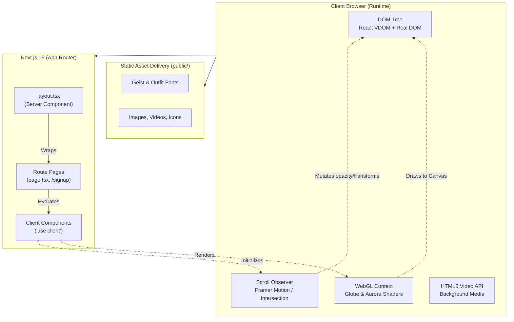
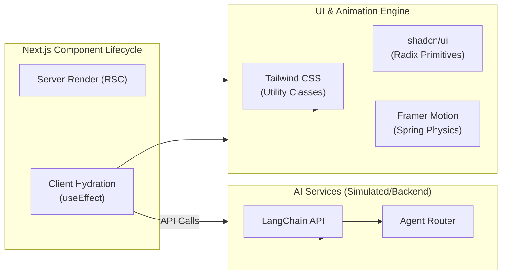
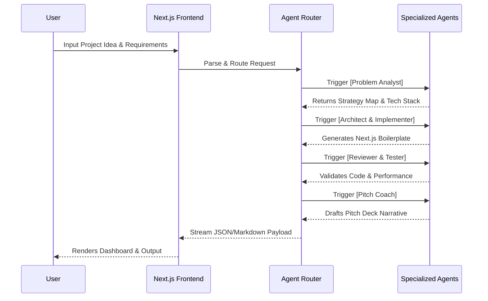
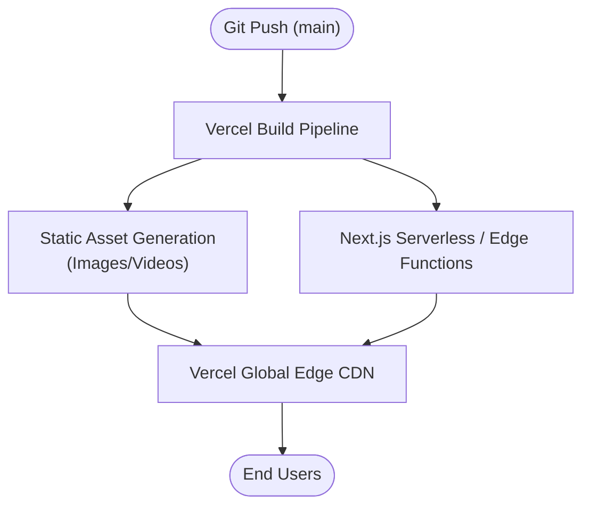

<div align="center">

# 🚀 AI SAAS Template
**The Ultimate High-Performance AI SaaS Boilerplate & Multi-Agent Orchestration Platform**

[](https://nextjs.org/)
[](https://www.typescriptlang.org/)
[](https://tailwindcss.com/)
[](https://ui.shadcn.com/)
[](https://opensource.org/licenses/MIT)

*A production-ready foundation designed to accelerate the development of AI-powered applications, from concept to MVP in record time.*

</div>

---

## 📖 Table of Contents
- [Overview](#-overview)
- [Tech Stack Core Components](#-tech-stack-core-components)
- [Folder & Directory Structure](#-folder--directory-structure)
- [System Architecture (Macro View)](#-system-architecture-macro-view)
- [Module Dependency Graph](#-module-dependency-graph)
- [Multi-Agent Orchestration Engine](#-multi-agent-orchestration-engine)
- [Cinematic UI & Animation Architecture](#-cinematic-ui--animation-architecture)
- [Core Features & Sections Breakdown](#-core-features--sections-breakdown)
- [Component Deep-Dives](#-component-deep-dives)
- [Data Intelligence & Analytics](#-data-intelligence--analytics)
- [Performance Optimizations](#-performance-optimizations)
- [Deployment Pipeline](#-deployment-pipeline)
- [Getting Started](#-getting-started)

---

## 🎯 Overview

**AI SAAS Template** is a state-of-the-art web platform engineered with **Next.js 15 (App Router)** and designed to act as the ultimate foundation for AI-driven SaaS applications. Beyond a standard boilerplate, this template comes equipped with a highly cinematic, interactive, and heavily optimized frontend. 

It implements a sophisticated multi-agent AI workflow right out of the box—complete with modular pipelines for problem parsing, automated code generation, and intelligent data analysis. The UI is built to impress, featuring scroll-driven animations, 3D WebGL globes, Aurora gradients, and buttery-smooth user interactions utilizing `shadcn/ui` and custom Framer Motion variants.

---

## 🛠️ Tech Stack Core Components

| Layer | Technology | Purpose |
|-------|-----------|---------|
| **Framework** | Next.js 15 (App Router) | Core routing, server-side rendering (SSR), and React Server Components (RSC). |
| **UI Library** | React 19 | Component rendering, state management, and modern hooks. |
| **Language** | TypeScript 5.x | Strict type safety across the entire codebase. |
| **Styling Engine** | Tailwind CSS 4.x | Utility-first CSS framework for rapid UI development and responsiveness. |
| **Component System**| shadcn/ui | Accessible, beautifully designed, and highly customizable UI primitives. |
| **Animations** | Custom WebGL / Framer | Powers the Aurora backgrounds, 3D globes, and scroll-linked cinematic effects. |
| **Typography** | Geist, Outfit, Inter | Premium, highly readable fonts loaded efficiently via `next/font`. |
| **Icons** | Phosphor Icons | A flexible icon family integrated via `@phosphor-icons/web`. |
| **Backend Integration**| LangChain / Python API | Handles the backend AI orchestration and multi-agent systems. |

---

## 📂 Folder & Directory Structure

```text
e:/AI SAAS Tenplate/
|
|-- package.json                 # Next.js workspace & dependencies
|-- next.config.ts               # Next.js bundler and compiler configuration
|-- tailwind.config.ts           # Tailwind theme, plugins, and styling rules
|-- tsconfig.json                # TypeScript compiler rules
|-- components.json              # shadcn/ui component configuration
|
|-- src/
|   |-- app/                     # Next.js App Router root
|   |   |-- layout.tsx           # Root layout: injects fonts, global CSS, and providers
|   |   |-- page.tsx             # The main landing page orchestrating the cinematic UI
|   |   |-- signup/              # Signup page featuring the MotionGrid animation
|   |   `-- globals.css          # Global Tailwind directives and base layer styles
|   |
|   |-- components/              # Modular UI elements and layout blocks
|   |   |-- ui/                  # Raw shadcn/ui primitives (buttons, cards, dialogs)
|   |   |-- Hero.tsx             # Aurora background and Globe wireframe logic
|   |   |-- Mission.tsx          # Strategy and mission statement section
|   |   |-- Showcase.tsx         # Scroll-driven tab animation engine
|   |   |-- Capabilities.tsx     # Bento-grid feature layout
|   |   |-- StatsSection.tsx     # Interactive data intelligence tabs
|   |   |-- VideoStories.tsx     # Testimonial video cards
|   |   `-- Footer.tsx           # Global navigation footer
|   |
|   `-- lib/                     # Shared TypeScript utilities (e.g., cn() for class merging)
|
`-- public/                      # Static assets mapped directly to domain root
    |-- assets/                  # Logos, icons, and placeholder imagery
    `-- videos/                  # Optimized background videos for Bento-grid cards
```

---

## 🏗️ System Architecture (Macro View)

This diagram maps the separation of Next.js Server-Side capabilities and the highly interactive client-side components powering the cinematic experience.



---

## 🧩 Module Dependency Graph



---

## 🤖 Multi-Agent Orchestration Engine

The core value proposition of the **AI SAAS Template** is its underlying multi-agent AI architecture. Instead of a single LLM call, the system utilizes a Swarm/Orchestration approach.

### The Agent Workflow Logic


---

## 🎬 Cinematic UI & Animation Architecture

The platform relies on cutting-edge visual techniques to create an immersive experience:

### 1. The Aurora Glow Engine
In `Hero.tsx`, an animated WebGL/Canvas shader creates an "Aurora" effect mixing blue (`#3b82f6`), purple (`#8b5cf6`), and pink (`#ec4899`). This runs on the GPU, ensuring 60fps performance without taxing the main thread.

### 2. 3D Wireframe Globe
The interactive globe renders 19 global city markers with animated connection arcs (e.g., SF → Tokyo, NY → London). It utilizes `requestAnimationFrame` to calculate spherical coordinates and draw curved SVG paths dynamically.

### 3. Scroll-Driven Cinematic Expansion
In `Showcase.tsx`, the UI listens to the browser's scroll position. As the user scrolls down:
- The video container dynamically calculates its `scale` and `border-radius`.
- It expands from a standard card size to fill 100% of the viewport width.
- This creates a seamless "theater mode" transition specifically tailored for SaaS product demos.

---

## 🌟 Core Features & Sections Breakdown

### 🔹 1. Hero Section
- **Headline:** Focuses on speed-to-market ("Build and Launch Your Startup MVP in Just 2 Weeks").
- **Social Proof Carousel:** An infinite-scrolling marquee of trusted enterprise logos (Qualcomm, Amazon, Adobe) utilizing CSS `@keyframes` for flawless looping.

### 🔹 2. Showcase (Technology Tabs)
Reveals the four stages of the AI workflow:
1. **Problem Analysis:** Parses constraints and success criteria.
2. **Strategy Engine:** Estimates timelines and tech stack compatibility.
3. **Code Co-Pilot:** Manages multi-agent parallel generation.
4. **Pitch Perfect:** Synthesizes build logs into compelling narratives.

### 🔹 3. Capabilities Section (Bento Grid)
Utilizes CSS Grid (`grid-cols-1 md:grid-cols-2 lg:grid-cols-3`) to create a modern Bento-box layout.
- Features embedded background videos (`<video autoPlay loop muted>`).
- Includes a continuously scrolling Tech Stack marquee (`React · TypeScript · Next.js · LangChain`).

### 🔹 4. Stats Section (Data Intelligence)
An interactive tabs component showcasing the system's accuracy and capabilities:
- **Problem Domains:** Highlights success rates across Fintech, Health, and AI.
- **Tech Stack Readiness:** Displays generation accuracy for Python (94%), React (88%), and Mobile (74%).

### 🔹 5. Video Stories & Testimonials
A sophisticated dual-column setup in `Testimonials.tsx`:
- **Left Column:** A sticky "Featured Founders" stack with active state management.
- **Right Column:** Two independent, auto-scrolling columns moving in opposite directions (`scroll-down` and `scroll-up`), creating a dynamic masonry effect.

---

## 🔍 Component Deep-Dives

### The Floating Navigation (`FloatingNav.tsx`)
A pill-shaped navigation bar fixed at the top-center. It employs a glassmorphism effect using Tailwind's `backdrop-blur-md` and `bg-white/10`. It scales up slightly on hover and tracks the active section for smooth anchoring.

### The Signup Flow (`SignupPage.tsx`)
Located at `/signup`, this page splits into two panels on desktop:
- **Left Panel:** The authentication form utilizing shadcn/ui forms, Zod validation, and React Hook Form.
- **Right Panel:** A purely aesthetic `MotionGrid` component rendering an animated background with a teal glow (`20, 184, 166`), diagonal grid blocks, and a blur canvas overlay.

---

## 📈 Data Intelligence & Analytics

The template is structured to ingest real-time statistics regarding agent performance:

| Metric | Target | Description |
|--------|--------|-------------|
| **Submission Completion** | 96% | Rate of teams completing their MVP vs baseline. |
| **Role Clarity** | 91% | AI-assisted task ownership distribution. |
| **Code Velocity** | 84% | Improvement in shipping speed via agent boilerplate generation. |
| **Pitch Readiness** | 95% | Impact of the AI Pitch Coach on final presentation quality. |

---

## ⚡ Performance Optimizations

1. **React Server Components (RSC):** The vast majority of the landing page is rendered on the server, drastically reducing the JavaScript payload sent to the client.
2. **Dynamic Imports:** Heavy client-side components (like the WebGL Globe) can be dynamically loaded using `next/dynamic`.
3. **Font Optimization:** `next/font` removes layout shift by hosting the Geist and Outfit fonts locally at build time.
4. **Media Fallbacks:** Background videos are strictly muted, compressed, and loop without audio tracks to bypass browser autoplay restrictions instantly.

---

## 🚀 Deployment Pipeline

This Next.js template is uniquely optimized for **Vercel's Edge Network**.



---

## 🏁 Getting Started

### Prerequisites
- Node.js 18.17 or later
- npm, pnpm, yarn, or bun

### 1. Installation
Clone the repository and install dependencies:
```bash
git clone https://github.com/your-username/ai-saas-template.git
cd ai-saas-template
npm install
```

### 2. Development
Start the Next.js development server:
```bash
npm run dev
```
Open [http://localhost:3000](http://localhost:3000) with your browser. The page auto-updates as you edit `app/page.tsx` or any components.

### 3. Production Build
Create an highly optimized production build:
```bash
npm run build
npm start
```

---

<div align="center">
  <b>Built for builders, by builders.</b><br>
  <i>Empower your next MVP launch with AI SAAS Template.</i>
</div>
